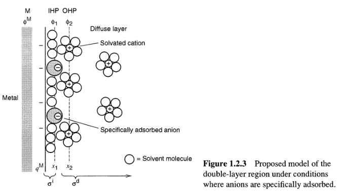
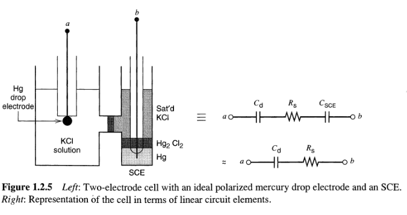
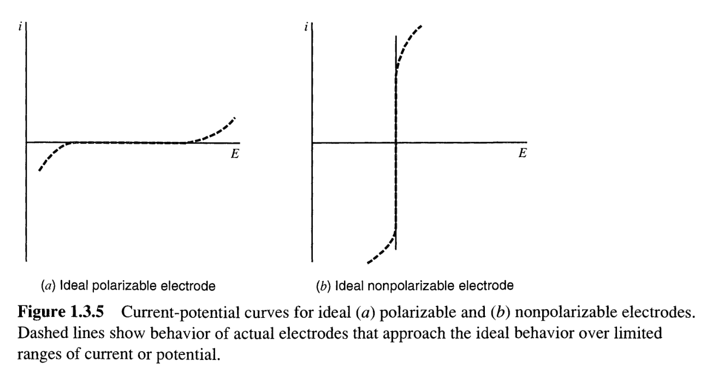
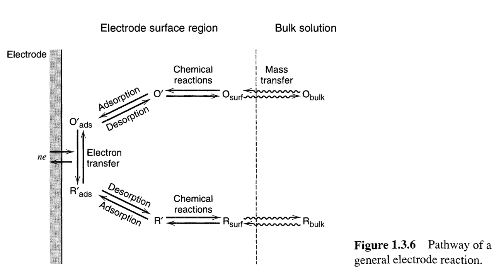
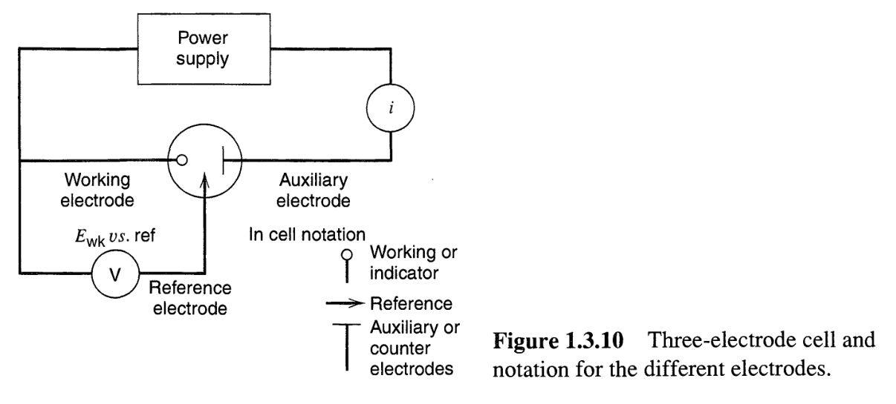
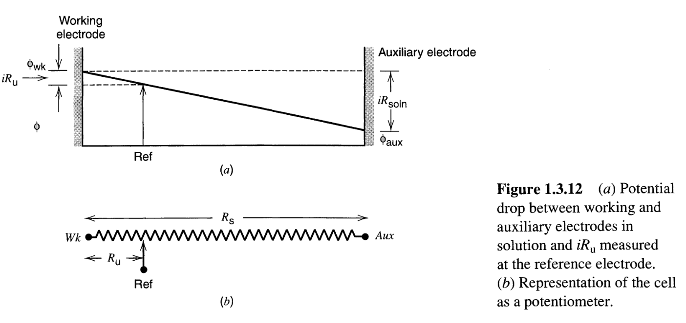
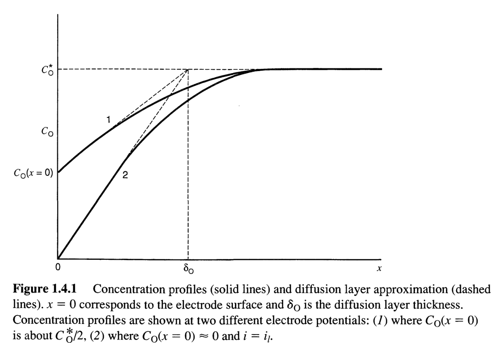
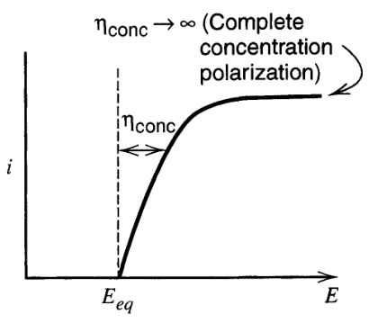
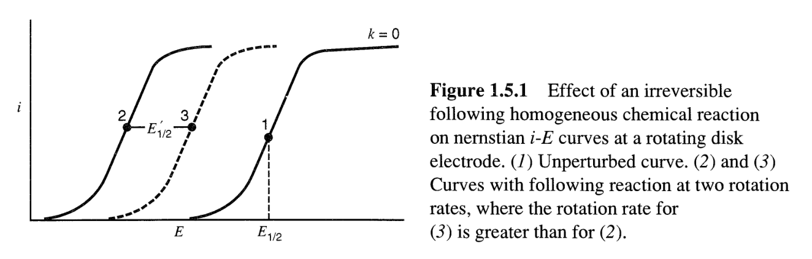

### Requirements 
##### Necessary:
* ipywidgets (conda install ipywidgets)
* bokeh (conda install bokeh)
* numpy (installed by default)
##### Optional:
* [Codefolding](https://github.com/ipython-contrib/jupyter_contrib_nbextensions/wiki/Codefolding)
- Install by typing the following into Anaconda prompt:
* pip install jupyter_contrib_nbextensions
* jupyter contrib nbextension install --user
* jupyter nbextension enable codefolding/main
* Restart Jupyter and in the /Tree directory, check for an NbExtensions tab and see that Codefolding is checked

### Table of Contents:
  * [Chapter 1.2](#chapter-2) Double Layer Capacitance
  * [Chapter 1.3](#chapter-3) Fardaic Processes
  * [Chapter 1.4](#chapter-4) Modes of Mass Transfer
  * [Chapter 1.5](#chapter-5) Nernstian Reactions with Coupled Chemical Reactions
  

### Chapter 1.2 <a id="chapter-2"></a>Double Layer Capacitance

##### Some Equations:
**Voltage Step**   
Response current: $$i = \frac{E}{R_s}e^{(-t/(R_sC_d))}$$
Charge stored: $$q = EC_d(1-e^{(-t/(R_sC_d))})$$


### Equivalent Linear Circuits



```python
# Optional check to install / make sure CodeFolding is active:

# Activate:
# ext_require_path = 'codefolding/main'
# try:  # notebook >= 4.2.0
#     from notebook.nbextensions import enable_nbextension
#     enable_nbextension('notebook', ext_require_path)
# except ImportError:
#     from notebook.nbextensions import EnableNBExtensionApp
#     EnableNBExtensionApp().enable_nbextension(ext_require_path)

# Check:
# from notebook.nbextensions import check_nbextension
# check_nbextension('codefolding', user=True)
# check_nbextension('codefolding/main.js', user=True)
```


```python
# Create the interactive graphs
from ipywidgets import interact
import numpy as np

from bokeh.io import push_notebook, show, output_notebook
from bokeh.layouts import gridplot
from bokeh.plotting import figure
output_notebook()

x = np.linspace(0, 60, 200)
E = 0.5
y = x*E*1/x
# Rs in Ohms
# Cd in uF
Rs=1
Cd=20
y2 = E/Rs*np.exp(-x/(Rs*Cd))

p = figure(title="Applied E", plot_height=300, plot_width=600, y_range=(-3,3))
pp = figure(title="Resultant i", plot_height=300, plot_width=600, x_range = p.x_range, y_range=p.y_range)
r = p.line(x, y, color="#2222aa", line_width=3)
rr = pp.line(x, y2, color="#2222aa", line_width=3)

def update(f, E=0.1, Rs=1, Cd=20):
    if   f == "step": 
        r.data_source.data['y'] = x*E*1/x
        rr.data_source.data['y'] = E/Rs*np.exp(-x/(Rs*Cd))
    elif f == "ramp":
        r.data_source.data['y'] = (E*x)/max(x)
        v=E/max(x)
        rr.data_source.data['y'] = v*Cd*(1-np.exp(-x/(Rs*Cd)))
    elif f == "triangle":
        r.data_source.data['y'] = np.concatenate((np.array((2*E*x)/max(x))[0:len(x)/2-1],np.array(2*E-(2*E*x)/max(x))[len(x)/2:len(x)-1]),axis=0)
        v=E/max(x)
        rr.data_source.data['y'] = np.concatenate((np.array(v*Cd*(1-np.exp(-x/(Rs*Cd))))[0:len(x)/2-1],np.array(-v*Cd*(1-np.exp(-x/(Rs*Cd))))[0:len(x)/2-1]),axis=0)
    push_notebook()
    
s = gridplot([[p],[pp]], toolbar_location=None)
show(s, notebook_handle=True)

```


    <div class="bk-root">
        <a href="http://bokeh.pydata.org" target="_blank" class="bk-logo bk-logo-small bk-logo-notebook"></a>
        <span id="b4e7876f-17e3-4551-a607-8573874ae909">Loading BokehJS ...</span>
    </div>


    <div class="bk-root">
        <div class="bk-plotdiv" id="d585c483-9296-4174-8b19-afae841c2ae9"></div>
    </div>
<script type="text/javascript">
  
  (function(global) {
    function now() {
      return new Date();
    }
  
    var force = false;
  
    if (typeof (window._bokeh_onload_callbacks) === "undefined" || force === true) {
      window._bokeh_onload_callbacks = [];
      window._bokeh_is_loading = undefined;
    }
  
  
    
    if (typeof (window._bokeh_timeout) === "undefined" || force === true) {
      window._bokeh_timeout = Date.now() + 0;
      window._bokeh_failed_load = false;
    }
  
    var NB_LOAD_WARNING = {'data': {'text/html':
       "<div style='background-color: #fdd'>\n"+
       "<p>\n"+
       "BokehJS does not appear to have successfully loaded. If loading BokehJS from CDN, this \n"+
       "may be due to a slow or bad network connection. Possible fixes:\n"+
       "</p>\n"+
       "<ul>\n"+
       "<li>re-rerun `output_notebook()` to attempt to load from CDN again, or</li>\n"+
       "<li>use INLINE resources instead, as so:</li>\n"+
       "</ul>\n"+
       "<code>\n"+
       "from bokeh.resources import INLINE\n"+
       "output_notebook(resources=INLINE)\n"+
       "</code>\n"+
       "</div>"}};
  
    function display_loaded() {
      if (window.Bokeh !== undefined) {
        document.getElementById("d585c483-9296-4174-8b19-afae841c2ae9").textContent = "BokehJS successfully loaded.";
      } else if (Date.now() < window._bokeh_timeout) {
        setTimeout(display_loaded, 100)
      }
    }if ((window.Jupyter !== undefined) && Jupyter.notebook.kernel) {
      comm_manager = Jupyter.notebook.kernel.comm_manager
      comm_manager.register_target("bd17d81c-08e1-4cf4-8812-1ea3a49bc11f", function () {});
    }
  
    function run_callbacks() {
      window._bokeh_onload_callbacks.forEach(function(callback) { callback() });
      delete window._bokeh_onload_callbacks
      console.info("Bokeh: all callbacks have finished");
    }
  
    function load_libs(js_urls, callback) {
      window._bokeh_onload_callbacks.push(callback);
      if (window._bokeh_is_loading > 0) {
        console.log("Bokeh: BokehJS is being loaded, scheduling callback at", now());
        return null;
      }
      if (js_urls == null || js_urls.length === 0) {
        run_callbacks();
        return null;
      }
      console.log("Bokeh: BokehJS not loaded, scheduling load and callback at", now());
      window._bokeh_is_loading = js_urls.length;
      for (var i = 0; i < js_urls.length; i++) {
        var url = js_urls[i];
        var s = document.createElement('script');
        s.src = url;
        s.async = false;
        s.onreadystatechange = s.onload = function() {
          window._bokeh_is_loading--;
          if (window._bokeh_is_loading === 0) {
            console.log("Bokeh: all BokehJS libraries loaded");
            run_callbacks()
          }
        };
        s.onerror = function() {
          console.warn("failed to load library " + url);
        };
        console.log("Bokeh: injecting script tag for BokehJS library: ", url);
        document.getElementsByTagName("head")[0].appendChild(s);
      }
    };var element = document.getElementById("d585c483-9296-4174-8b19-afae841c2ae9");
    if (element == null) {
      console.log("Bokeh: ERROR: autoload.js configured with elementid 'd585c483-9296-4174-8b19-afae841c2ae9' but no matching script tag was found. ")
      return false;
    }
  
    var js_urls = [];
  
    var inline_js = [
      function(Bokeh) {
        (function() {
          var fn = function() {
            var docs_json = {"3bbf5687-7989-4a88-884f-a72881adfeff":{"roots":{"references":[{"attributes":{"plot":null,"text":"Resultant i"},"id":"54be7385-33a5-48c5-ba36-0c19c95e7cde","type":"Title"},{"attributes":{},"id":"a6b3ceaa-53e5-4ef3-9aab-ad9b5dcb00f5","type":"ToolEvents"},{"attributes":{"plot":{"id":"6460956a-2cc7-49eb-bad5-103cac41974d","subtype":"Figure","type":"Plot"}},"id":"4b9a3259-9c5f-4c1a-89eb-fd5bfdca4b5a","type":"HelpTool"},{"attributes":{"line_alpha":{"value":0.1},"line_color":{"value":"#1f77b4"},"line_width":{"value":3},"x":{"field":"x"},"y":{"field":"y"}},"id":"f90bbb1a-ccd8-406e-b2ea-ae3adba57955","type":"Line"},{"attributes":{"plot":{"id":"6460956a-2cc7-49eb-bad5-103cac41974d","subtype":"Figure","type":"Plot"}},"id":"cca6b9b1-4f8c-4eb6-b19a-dff04d5afee2","type":"ResetTool"},{"attributes":{"dimension":1,"plot":{"id":"6460956a-2cc7-49eb-bad5-103cac41974d","subtype":"Figure","type":"Plot"},"ticker":{"id":"f328888c-73ae-4beb-a9cf-6268d011f410","type":"BasicTicker"}},"id":"94fc6ff6-3f81-4928-99e3-246dc092825f","type":"Grid"},{"attributes":{"below":[{"id":"9e34b21c-d35c-4a05-ac48-3d73eedfa1e7","type":"LinearAxis"}],"left":[{"id":"1adb4995-3351-43de-b743-50023d4e1345","type":"LinearAxis"}],"plot_height":300,"renderers":[{"id":"9e34b21c-d35c-4a05-ac48-3d73eedfa1e7","type":"LinearAxis"},{"id":"ca21bec5-e501-4d34-b666-5d2cf3b406fd","type":"Grid"},{"id":"1adb4995-3351-43de-b743-50023d4e1345","type":"LinearAxis"},{"id":"11242f29-3bad-477f-9278-46872a561c49","type":"Grid"},{"id":"ed213bae-ae73-4e78-a045-50a7883c6f2e","type":"BoxAnnotation"},{"id":"3c55eb4a-5a9c-41d9-aeb9-70696c62cd4e","type":"GlyphRenderer"}],"title":{"id":"54be7385-33a5-48c5-ba36-0c19c95e7cde","type":"Title"},"tool_events":{"id":"a6b3ceaa-53e5-4ef3-9aab-ad9b5dcb00f5","type":"ToolEvents"},"toolbar":{"id":"e530f2e2-a95a-46eb-a85d-db050ca0d875","type":"Toolbar"},"toolbar_location":null,"x_range":{"id":"22f4d3d0-25af-4115-86e0-8db89dd6fd3c","type":"DataRange1d"},"y_range":{"id":"a725d9a8-05ca-474f-91d3-17ef71a76556","type":"Range1d"}},"id":"511f0c7d-3499-443a-8cef-315bc952b9f0","subtype":"Figure","type":"Plot"},{"attributes":{"plot":{"id":"511f0c7d-3499-443a-8cef-315bc952b9f0","subtype":"Figure","type":"Plot"},"ticker":{"id":"d5f22f9d-dde7-454d-bd11-0d5ca40628a2","type":"BasicTicker"}},"id":"ca21bec5-e501-4d34-b666-5d2cf3b406fd","type":"Grid"},{"attributes":{"plot":{"id":"511f0c7d-3499-443a-8cef-315bc952b9f0","subtype":"Figure","type":"Plot"}},"id":"8b91ee6c-061d-41fc-900e-68eb4e38eb24","type":"SaveTool"},{"attributes":{"line_color":{"value":"#2222aa"},"line_width":{"value":3},"x":{"field":"x"},"y":{"field":"y"}},"id":"e8016b5b-f0c5-4ffc-ab7d-3f6cb9f97ff4","type":"Line"},{"attributes":{"plot":{"id":"6460956a-2cc7-49eb-bad5-103cac41974d","subtype":"Figure","type":"Plot"},"ticker":{"id":"3d46cba6-24f0-491a-be9c-e85628d8aec0","type":"BasicTicker"}},"id":"9e6dfce6-600b-4fc6-9bb8-a722e275b417","type":"Grid"},{"attributes":{"children":[{"id":"6460956a-2cc7-49eb-bad5-103cac41974d","subtype":"Figure","type":"Plot"}]},"id":"7ca79a86-0988-409a-97f1-10963d2cb739","type":"Row"},{"attributes":{"bottom_units":"screen","fill_alpha":{"value":0.5},"fill_color":{"value":"lightgrey"},"left_units":"screen","level":"overlay","line_alpha":{"value":1.0},"line_color":{"value":"black"},"line_dash":[4,4],"line_width":{"value":2},"plot":null,"render_mode":"css","right_units":"screen","top_units":"screen"},"id":"ed213bae-ae73-4e78-a045-50a7883c6f2e","type":"BoxAnnotation"},{"attributes":{"plot":{"id":"511f0c7d-3499-443a-8cef-315bc952b9f0","subtype":"Figure","type":"Plot"}},"id":"952c359f-68d6-4170-a55c-f292b25724d3","type":"ResetTool"},{"attributes":{"overlay":{"id":"4dee81f0-2f72-4584-9b76-3c6b931cd131","type":"BoxAnnotation"},"plot":{"id":"6460956a-2cc7-49eb-bad5-103cac41974d","subtype":"Figure","type":"Plot"}},"id":"10db1a51-9de6-4389-9de8-2ab5a5cf3a25","type":"BoxZoomTool"},{"attributes":{},"id":"3d46cba6-24f0-491a-be9c-e85628d8aec0","type":"BasicTicker"},{"attributes":{"plot":{"id":"511f0c7d-3499-443a-8cef-315bc952b9f0","subtype":"Figure","type":"Plot"}},"id":"353c226f-a23f-4fa9-8bf3-e522e6e835b9","type":"WheelZoomTool"},{"attributes":{"overlay":{"id":"ed213bae-ae73-4e78-a045-50a7883c6f2e","type":"BoxAnnotation"},"plot":{"id":"511f0c7d-3499-443a-8cef-315bc952b9f0","subtype":"Figure","type":"Plot"}},"id":"9194b039-1ea3-472a-8b5c-a2f49f2f80c8","type":"BoxZoomTool"},{"attributes":{"formatter":{"id":"7bf452e2-8eb5-4099-b349-dee742f46527","type":"BasicTickFormatter"},"plot":{"id":"6460956a-2cc7-49eb-bad5-103cac41974d","subtype":"Figure","type":"Plot"},"ticker":{"id":"f328888c-73ae-4beb-a9cf-6268d011f410","type":"BasicTicker"}},"id":"a041385e-9ce1-428e-aa6a-6ac7c34ea47a","type":"LinearAxis"},{"attributes":{"callback":null,"column_names":["y","x"],"data":{"x":{"__ndarray__":"AAAAAAAAAABgo3dF5kvTP2Cjd0XmS+M/EHUzaNnx7D9go3dF5kvzPziM1dbfHvg/EHUzaNnx/D/0rsh8aeIAQGCjd0XmSwNAzJcmDmO1BUA4jNXW3x4IQKSAhJ9ciApAEHUzaNnxDEB8aeIwVlsPQPSuyHxp4hBAKikg4ScXEkBgo3dF5ksTQJYdz6mkgBRAzJcmDmO1FUACEn5yIeoWQDiM1dbfHhhAbgYtO55TGUCkgISfXIgaQNr62wMbvRtAEHUzaNnxHEBG74rMlyYeQHxp4jBWWx9A2fGcSgpIIED0rsh8aeIgQA9s9K7IfCFAKikg4ScXIkBF5ksTh7EiQGCjd0XmSyNAe2Cjd0XmI0CWHc+ppIAkQLHa+tsDGyVAzJcmDmO1JUDnVFJAwk8mQAISfnIh6iZAHc+ppICEJ0A4jNXW3x4oQFNJAQk/uShAbgYtO55TKUCJw1ht/e0pQKSAhJ9ciCpAvz2w0bsiK0Da+tsDG70rQPW3BzZ6VyxAEHUzaNnxLEArMl+aOIwtQEbvisyXJi5AYay2/vbALkB8aeIwVlsvQJcmDmO19S9A2fGcSgpIMEBm0LLjOZUwQPSuyHxp4jBAgo3eFZkvMUAPbPSuyHwxQJxKCkj4yTFAKikg4ScXMkC4BzZ6V2QyQEXmSxOHsTJA0sRhrLb+MkBgo3dF5kszQO6Bjd4VmTNAe2Cjd0XmM0AIP7kQdTM0QJYdz6mkgDRAJPzkQtTNNECx2vrbAxs1QD65EHUzaDVAzJcmDmO1NUBadjynkgI2QOdUUkDCTzZAdDNo2fGcNkACEn5yIeo2QJDwkwtRNzdAHc+ppICEN0Cqrb89sNE3QDiM1dbfHjhAxmrrbw9sOEBTSQEJP7k4QOAnF6JuBjlAbgYtO55TOUD85ELUzaA5QInDWG397TlAFqJuBi07OkCkgISfXIg6QDJfmjiM1TpAvz2w0bsiO0BMHMZq6287QNr62wMbvTtAaNnxnEoKPED1twc2elc8QIKWHc+ppDxAEHUzaNnxPECeU0kBCT89QCsyX5o4jD1AuBB1M2jZPUBG74rMlyY+QNTNoGXHcz5AYay2/vbAPkDuisyXJg4/QHxp4jBWWz9ACkj4yYWoP0CXJg5jtfU/QJICEn5yIUBA2fGcSgpIQEAg4ScXom5AQGbQsuM5lUBArb89sNG7QED0rsh8aeJAQDueU0kBCUFAgo3eFZkvQUDIfGniMFZBQA9s9K7IfEFAVlt/e2CjQUCcSgpI+MlBQOM5lRSQ8EFAKikg4ScXQkBxGKutvz1CQLgHNnpXZEJA/vbARu+KQkBF5ksTh7FCQIzV1t8e2EJA0sRhrLb+QkAZtOx4TiVDQGCjd0XmS0NAp5ICEn5yQ0DugY3eFZlDQDRxGKutv0NAe2Cjd0XmQ0DCTy5E3QxEQAg/uRB1M0RATy5E3QxaRECWHc+ppIBEQN0MWnY8p0RAJPzkQtTNREBq628PbPREQLHa+tsDG0VA+MmFqJtBRUA+uRB1M2hFQIWom0HLjkVAzJcmDmO1RUATh7Ha+ttFQFp2PKeSAkZAoGXHcyopRkDnVFJAwk9GQC5E3QxadkZAdDNo2fGcRkC7IvOlicNGQAISfnIh6kZASQEJP7kQR0CQ8JMLUTdHQNbfHtjoXUdAHc+ppICER0BkvjRxGKtHQKqtvz2w0UdA8ZxKCkj4R0A4jNXW3x5IQH97YKN3RUhAxmrrbw9sSEAMWnY8p5JIQFNJAQk/uUhAmjiM1dbfSEDgJxeibgZJQCcXom4GLUlAbgYtO55TSUC19bcHNnpJQPzkQtTNoElAQtTNoGXHSUCJw1ht/e1JQNCy4zmVFEpAFqJuBi07SkBdkfnSxGFKQKSAhJ9ciEpA628PbPSuSkAyX5o4jNVKQHhOJQUk/EpAvz2w0bsiS0AGLTueU0lLQEwcxmrrb0tAkwtRN4OWS0Da+tsDG71LQCHqZtCy40tAaNnxnEoKTECuyHxp4jBMQPW3BzZ6V0xAPKeSAhJ+TECClh3PqaRMQMmFqJtBy0xAEHUzaNnxTEBXZL40cRhNQJ5TSQEJP01A5ELUzaBlTUArMl+aOIxNQHIh6mbQsk1AuBB1M2jZTUAAAAAAAABOQA==","dtype":"float64","shape":[200]},"y":{"__ndarray__":"AAAAAAAA4D/BdsTBbYXfP9HLPwGxDN8/YRchuMKV3j+QoP/6myDeP0HN8/g1rd0/tJwx+4k73T//pqRkkcvcP4ybjbFFXdw/7Tghd6Dw2z9ZuChjm4XbP0CnozswHNs/hSlr3li02j/yntZAD07aP5amYW9N6dk/zXpTjQ2G2T/ZoGfUSSTZP+Lmd5T8w9g/bqsnMyBl2D9UaZArrwfYP2CD7w2kq9c/0EpVf/lQ1z/6O1U5qvfWP39stwmxn9Y/YyYr0ghJ1j+oq/qHrPPVP90dwDOXn9U/XoUb8cNM1T/e82nuLfvUPxG+fWzQqtQ/SMhXvqZb1D/Q4eFIrA3UPxcrqoLcwNM/n4Kf8zJ10z+z9M40qyrTPygqIvBA4dI/MdIe4O+Y0j+jA6fPs1HSP+ORupmIC9I/4VE5KWrG0T+ES6Z4VILRP//T65FDP9E/m40gjjP90D9zSU2VILzQP9bHM94GfNA/8lMWruI80D/pbgCxYP3PP/oFHn7Ygs8/QlB5oiUKzz+1w1QYQZPOP8fQ2PQjHs4/pdqsZ8eqzT8oupG6JDnNP3/F/VA1ycw/ula6p/JazD+dy4JUVu7LP+L4pAVag8s/kgujgfcZyz/X0tamKLLKP+JsFmvnS8o/sVFa2y3nyT9ftmQb9oPJP9tDamU6Isk/+Bu8CfXByD/UJ3NuIGPIP62qHA+3Bcg/MhRofLOpxz+pDdZbEE/HPyO9aGfI9cY/GTpVbdadxj/gLrZPNUfGP32iPwTg8cU/Y+bzk9GdxT+8o9kaBUvFP/MDs8d1+cQ/OvC12x6pxD/xY0Wq+1nEP7vNq5gHDMQ/S3vWHT6/wz/OCxLCmnPDPyPlxx4ZKcM/+ac83rTfwj/unk+7aZfCPwMlO4EzUMI/sv9VCw4Kwj/9qNVE9cTBP8qFkSjlgME/LQXHwNk9wT/7pN4mz/vAP1bYMYPBusA/tszRDK16wD83Ck8JjjvAP5LXA5nB+r8/NNincEOAvz8MiBN5mge/P8iuHK2/kL4/Q9p8Iqwbvj8+X2oJWai9P6TkMqy/Nr0/XHPXbtnGvD/oBKrOn1i8PzKL7GEM7Ls/pGtx1xiBuz8naD32vhe7P5jwKp34r7o/N9eOwr9Juj+1Yt5zDuW5P9S4VtXegbk/QJylISsguT+1eJOp7b+4P024rtMgYbg/IV34G78DuD902pETw6e3P14obGAnTbc/mg34vObztj+Lmtf3+5u2PwbRkPNhRbY/anRBphPwtT+I/VMZDJy1P+ytNWlGSbU/br4Nxb33tD+XpHVubae0P85qMrlQWLQ/JBfvCmMKtD+4HPjan72zP77T97ECcrM/GfSzKYcnsz/YDszsKN6yP6kCebbjlbI/g2dNUrNOsj/X7fabkwiyP7GtAH+Aw7E/DWKW9nV/sT8NjUgNcDyxP2SB0dxq+rA/mE3bjWK5sD/MhcZXU3mwP6LocYA5OrA/7LcFuCL4rz+mfF2Zrn2vP2wTCoUPBa8/kYl0dj6Orj99fueDNBmuP8osKN7qpa0/6v0Q0Fo0rT8Xoi2+fcSsPyKnWCZNVqw/EIhan8Lpqz8QMIrY136rP0LrbpmGFas/t79jwcitqj9JKTxHmEeqPycz6jjv4qk/qeklu8d/qT9QHxYJHB6pP/Z/+nPmvag/B+3WYiFfqD8QHiBSxwGoP3+AadPSpac/EFIUjT5Lpz8V8f85BfKmP+pdO6khmqY/Hem3vY5Dpj/DCf1tR+6lP3VX3cNGmqU/wKMs3IdHpT+lLnfmBfakP9LxuSS8paQ/r/4b66VWpD/P6qifvgikP/1GDLoBvKM/uBxOw2pwoz9XbpBV9SWjP9y1zRud3KI/sF6Y0V2Uoj98NttCM02iP43RmksZB6I/8t631wvCoT/XaLLiBn6hP6H9bXcGO6E/Ib72rwb5oD+xTUe1A7igP5qgD7/5d6A/laV8E+U4oD9OjgEOhPWfP96COvgZe58/8ZJYxoQCnz9qBVh0vYueP0l/FBm9Fp4/WxXi5XyjnT8L6Ccm9jGdP5ND/D4iwpw/0D7CrvpTnD/h0sgMeeebP+pl6wiXfJs/isMza04Tmz9rfX0TmauaP7iuGvlwRZo/3hx6KtDgmT+vsM7MsH2ZPw==","dtype":"float64","shape":[200]}}},"id":"d356b2d2-5bcd-4de1-8d2f-7d3ec0ed0ee1","type":"ColumnDataSource"},{"attributes":{"data_source":{"id":"8ea6fb16-e9cf-457e-ae70-f1df4b6a7dbe","type":"ColumnDataSource"},"glyph":{"id":"e8016b5b-f0c5-4ffc-ab7d-3f6cb9f97ff4","type":"Line"},"hover_glyph":null,"nonselection_glyph":{"id":"f90bbb1a-ccd8-406e-b2ea-ae3adba57955","type":"Line"},"selection_glyph":null},"id":"af5f33cd-5083-4153-a11f-be112fc51977","type":"GlyphRenderer"},{"attributes":{"line_alpha":{"value":0.1},"line_color":{"value":"#1f77b4"},"line_width":{"value":3},"x":{"field":"x"},"y":{"field":"y"}},"id":"4c555f19-3ceb-43e5-8dd2-46a25cf633b7","type":"Line"},{"attributes":{"plot":{"id":"6460956a-2cc7-49eb-bad5-103cac41974d","subtype":"Figure","type":"Plot"}},"id":"e3503f65-3a99-4298-b586-fa3416ad19b9","type":"PanTool"},{"attributes":{},"id":"03a3636d-f674-47db-b9e5-3201fd61a04b","type":"BasicTickFormatter"},{"attributes":{"children":[{"id":"7ca79a86-0988-409a-97f1-10963d2cb739","type":"Row"},{"id":"8839b19a-6872-4d8a-aa2a-f54132bc9e58","type":"Row"}]},"id":"172eab50-d94f-475f-9e1d-b5ab94a7f965","type":"Column"},{"attributes":{},"id":"f328888c-73ae-4beb-a9cf-6268d011f410","type":"BasicTicker"},{"attributes":{},"id":"1c9f45ba-e688-4d5f-ac42-04d3ae6da889","type":"ToolEvents"},{"attributes":{"formatter":{"id":"03a3636d-f674-47db-b9e5-3201fd61a04b","type":"BasicTickFormatter"},"plot":{"id":"511f0c7d-3499-443a-8cef-315bc952b9f0","subtype":"Figure","type":"Plot"},"ticker":{"id":"d5f22f9d-dde7-454d-bd11-0d5ca40628a2","type":"BasicTicker"}},"id":"9e34b21c-d35c-4a05-ac48-3d73eedfa1e7","type":"LinearAxis"},{"attributes":{"dimension":1,"plot":{"id":"511f0c7d-3499-443a-8cef-315bc952b9f0","subtype":"Figure","type":"Plot"},"ticker":{"id":"59a2b610-1e29-4c4c-9f01-bd6f86a4ab00","type":"BasicTicker"}},"id":"11242f29-3bad-477f-9278-46872a561c49","type":"Grid"},{"attributes":{},"id":"a3bb7fd2-13ca-4e0a-82c6-0938d9662559","type":"BasicTickFormatter"},{"attributes":{"plot":{"id":"6460956a-2cc7-49eb-bad5-103cac41974d","subtype":"Figure","type":"Plot"}},"id":"987b24e3-0b8b-4ee2-85cf-8879b2d48f8f","type":"WheelZoomTool"},{"attributes":{"active_drag":"auto","active_scroll":"auto","active_tap":"auto","tools":[{"id":"e3503f65-3a99-4298-b586-fa3416ad19b9","type":"PanTool"},{"id":"987b24e3-0b8b-4ee2-85cf-8879b2d48f8f","type":"WheelZoomTool"},{"id":"10db1a51-9de6-4389-9de8-2ab5a5cf3a25","type":"BoxZoomTool"},{"id":"1902df29-c874-4a54-91de-9bb134fedc67","type":"SaveTool"},{"id":"cca6b9b1-4f8c-4eb6-b19a-dff04d5afee2","type":"ResetTool"},{"id":"4b9a3259-9c5f-4c1a-89eb-fd5bfdca4b5a","type":"HelpTool"}]},"id":"642c6646-6df5-4c01-8de6-903ff03ee8f4","type":"Toolbar"},{"attributes":{"line_color":{"value":"#2222aa"},"line_width":{"value":3},"x":{"field":"x"},"y":{"field":"y"}},"id":"445dbb2c-696b-44e3-8cd9-1f1ae75ab029","type":"Line"},{"attributes":{"children":[{"id":"511f0c7d-3499-443a-8cef-315bc952b9f0","subtype":"Figure","type":"Plot"}]},"id":"8839b19a-6872-4d8a-aa2a-f54132bc9e58","type":"Row"},{"attributes":{"callback":null,"end":3,"start":-3},"id":"a725d9a8-05ca-474f-91d3-17ef71a76556","type":"Range1d"},{"attributes":{"formatter":{"id":"a3bb7fd2-13ca-4e0a-82c6-0938d9662559","type":"BasicTickFormatter"},"plot":{"id":"511f0c7d-3499-443a-8cef-315bc952b9f0","subtype":"Figure","type":"Plot"},"ticker":{"id":"59a2b610-1e29-4c4c-9f01-bd6f86a4ab00","type":"BasicTicker"}},"id":"1adb4995-3351-43de-b743-50023d4e1345","type":"LinearAxis"},{"attributes":{"data_source":{"id":"d356b2d2-5bcd-4de1-8d2f-7d3ec0ed0ee1","type":"ColumnDataSource"},"glyph":{"id":"445dbb2c-696b-44e3-8cd9-1f1ae75ab029","type":"Line"},"hover_glyph":null,"nonselection_glyph":{"id":"4c555f19-3ceb-43e5-8dd2-46a25cf633b7","type":"Line"},"selection_glyph":null},"id":"3c55eb4a-5a9c-41d9-aeb9-70696c62cd4e","type":"GlyphRenderer"},{"attributes":{"plot":{"id":"511f0c7d-3499-443a-8cef-315bc952b9f0","subtype":"Figure","type":"Plot"}},"id":"4bc584ad-31b4-4397-aa56-d5472967b488","type":"PanTool"},{"attributes":{"formatter":{"id":"72089395-fd7b-4f7e-9167-e1d04eb7e57c","type":"BasicTickFormatter"},"plot":{"id":"6460956a-2cc7-49eb-bad5-103cac41974d","subtype":"Figure","type":"Plot"},"ticker":{"id":"3d46cba6-24f0-491a-be9c-e85628d8aec0","type":"BasicTicker"}},"id":"cbed76d7-bfed-4f81-a7f7-012a3994fa19","type":"LinearAxis"},{"attributes":{"plot":{"id":"511f0c7d-3499-443a-8cef-315bc952b9f0","subtype":"Figure","type":"Plot"}},"id":"6a68652a-4b40-4804-aa96-5cd7e11b0641","type":"HelpTool"},{"attributes":{"plot":null,"text":"Applied E"},"id":"123610e0-4e53-4602-8ebe-257c154c2e4f","type":"Title"},{"attributes":{"plot":{"id":"6460956a-2cc7-49eb-bad5-103cac41974d","subtype":"Figure","type":"Plot"}},"id":"1902df29-c874-4a54-91de-9bb134fedc67","type":"SaveTool"},{"attributes":{"callback":null,"column_names":["y","x"],"data":{"x":{"__ndarray__":"AAAAAAAAAABgo3dF5kvTP2Cjd0XmS+M/EHUzaNnx7D9go3dF5kvzPziM1dbfHvg/EHUzaNnx/D/0rsh8aeIAQGCjd0XmSwNAzJcmDmO1BUA4jNXW3x4IQKSAhJ9ciApAEHUzaNnxDEB8aeIwVlsPQPSuyHxp4hBAKikg4ScXEkBgo3dF5ksTQJYdz6mkgBRAzJcmDmO1FUACEn5yIeoWQDiM1dbfHhhAbgYtO55TGUCkgISfXIgaQNr62wMbvRtAEHUzaNnxHEBG74rMlyYeQHxp4jBWWx9A2fGcSgpIIED0rsh8aeIgQA9s9K7IfCFAKikg4ScXIkBF5ksTh7EiQGCjd0XmSyNAe2Cjd0XmI0CWHc+ppIAkQLHa+tsDGyVAzJcmDmO1JUDnVFJAwk8mQAISfnIh6iZAHc+ppICEJ0A4jNXW3x4oQFNJAQk/uShAbgYtO55TKUCJw1ht/e0pQKSAhJ9ciCpAvz2w0bsiK0Da+tsDG70rQPW3BzZ6VyxAEHUzaNnxLEArMl+aOIwtQEbvisyXJi5AYay2/vbALkB8aeIwVlsvQJcmDmO19S9A2fGcSgpIMEBm0LLjOZUwQPSuyHxp4jBAgo3eFZkvMUAPbPSuyHwxQJxKCkj4yTFAKikg4ScXMkC4BzZ6V2QyQEXmSxOHsTJA0sRhrLb+MkBgo3dF5kszQO6Bjd4VmTNAe2Cjd0XmM0AIP7kQdTM0QJYdz6mkgDRAJPzkQtTNNECx2vrbAxs1QD65EHUzaDVAzJcmDmO1NUBadjynkgI2QOdUUkDCTzZAdDNo2fGcNkACEn5yIeo2QJDwkwtRNzdAHc+ppICEN0Cqrb89sNE3QDiM1dbfHjhAxmrrbw9sOEBTSQEJP7k4QOAnF6JuBjlAbgYtO55TOUD85ELUzaA5QInDWG397TlAFqJuBi07OkCkgISfXIg6QDJfmjiM1TpAvz2w0bsiO0BMHMZq6287QNr62wMbvTtAaNnxnEoKPED1twc2elc8QIKWHc+ppDxAEHUzaNnxPECeU0kBCT89QCsyX5o4jD1AuBB1M2jZPUBG74rMlyY+QNTNoGXHcz5AYay2/vbAPkDuisyXJg4/QHxp4jBWWz9ACkj4yYWoP0CXJg5jtfU/QJICEn5yIUBA2fGcSgpIQEAg4ScXom5AQGbQsuM5lUBArb89sNG7QED0rsh8aeJAQDueU0kBCUFAgo3eFZkvQUDIfGniMFZBQA9s9K7IfEFAVlt/e2CjQUCcSgpI+MlBQOM5lRSQ8EFAKikg4ScXQkBxGKutvz1CQLgHNnpXZEJA/vbARu+KQkBF5ksTh7FCQIzV1t8e2EJA0sRhrLb+QkAZtOx4TiVDQGCjd0XmS0NAp5ICEn5yQ0DugY3eFZlDQDRxGKutv0NAe2Cjd0XmQ0DCTy5E3QxEQAg/uRB1M0RATy5E3QxaRECWHc+ppIBEQN0MWnY8p0RAJPzkQtTNREBq628PbPREQLHa+tsDG0VA+MmFqJtBRUA+uRB1M2hFQIWom0HLjkVAzJcmDmO1RUATh7Ha+ttFQFp2PKeSAkZAoGXHcyopRkDnVFJAwk9GQC5E3QxadkZAdDNo2fGcRkC7IvOlicNGQAISfnIh6kZASQEJP7kQR0CQ8JMLUTdHQNbfHtjoXUdAHc+ppICER0BkvjRxGKtHQKqtvz2w0UdA8ZxKCkj4R0A4jNXW3x5IQH97YKN3RUhAxmrrbw9sSEAMWnY8p5JIQFNJAQk/uUhAmjiM1dbfSEDgJxeibgZJQCcXom4GLUlAbgYtO55TSUC19bcHNnpJQPzkQtTNoElAQtTNoGXHSUCJw1ht/e1JQNCy4zmVFEpAFqJuBi07SkBdkfnSxGFKQKSAhJ9ciEpA628PbPSuSkAyX5o4jNVKQHhOJQUk/EpAvz2w0bsiS0AGLTueU0lLQEwcxmrrb0tAkwtRN4OWS0Da+tsDG71LQCHqZtCy40tAaNnxnEoKTECuyHxp4jBMQPW3BzZ6V0xAPKeSAhJ+TECClh3PqaRMQMmFqJtBy0xAEHUzaNnxTEBXZL40cRhNQJ5TSQEJP01A5ELUzaBlTUArMl+aOIxNQHIh6mbQsk1AuBB1M2jZTUAAAAAAAABOQA==","dtype":"float64","shape":[200]},"y":{"__ndarray__":"AAAAAAAA+P8AAAAAAADgPwAAAAAAAOA/AAAAAAAA4D8AAAAAAADgPwAAAAAAAOA/AAAAAAAA4D8AAAAAAADgPwAAAAAAAOA/AAAAAAAA4D8AAAAAAADgPwAAAAAAAOA/AAAAAAAA4D8AAAAAAADgPwAAAAAAAOA/AAAAAAAA4D8AAAAAAADgPwAAAAAAAOA/AAAAAAAA4D8AAAAAAADgPwAAAAAAAOA/AAAAAAAA4D8AAAAAAADgPwAAAAAAAOA/AAAAAAAA4D8AAAAAAADgPwAAAAAAAOA/AAAAAAAA4D8AAAAAAADgPwAAAAAAAOA/AAAAAAAA4D8AAAAAAADgPwAAAAAAAOA/AAAAAAAA4D8AAAAAAADgPwAAAAAAAOA/AAAAAAAA4D8AAAAAAADgPwAAAAAAAOA/AAAAAAAA4D8AAAAAAADgPwAAAAAAAOA/AAAAAAAA4D8AAAAAAADgPwAAAAAAAOA/AAAAAAAA4D8AAAAAAADgPwAAAAAAAOA/AAAAAAAA4D8AAAAAAADgPwAAAAAAAOA/AAAAAAAA4D8AAAAAAADgPwAAAAAAAOA/AAAAAAAA4D8AAAAAAADgPwAAAAAAAOA/AAAAAAAA4D8AAAAAAADgPwAAAAAAAOA/AAAAAAAA4D8AAAAAAADgPwAAAAAAAOA/AAAAAAAA4D8AAAAAAADgPwAAAAAAAOA/AAAAAAAA4D8AAAAAAADgPwAAAAAAAOA/AAAAAAAA4D8AAAAAAADgPwAAAAAAAOA/AAAAAAAA4D8AAAAAAADgPwAAAAAAAOA/AAAAAAAA4D8AAAAAAADgPwAAAAAAAOA/AAAAAAAA4D8AAAAAAADgPwAAAAAAAOA/AAAAAAAA4D8AAAAAAADgPwAAAAAAAOA/AAAAAAAA4D8AAAAAAADgPwAAAAAAAOA/AAAAAAAA4D8AAAAAAADgPwAAAAAAAOA/AAAAAAAA4D8AAAAAAADgPwAAAAAAAOA/AAAAAAAA4D8AAAAAAADgPwAAAAAAAOA/AAAAAAAA4D8AAAAAAADgPwAAAAAAAOA/AAAAAAAA4D8AAAAAAADgPwAAAAAAAOA/AAAAAAAA4D8AAAAAAADgPwAAAAAAAOA/AAAAAAAA4D8AAAAAAADgPwAAAAAAAOA/AAAAAAAA4D8AAAAAAADgPwAAAAAAAOA/AAAAAAAA4D8AAAAAAADgPwAAAAAAAOA/AAAAAAAA4D8AAAAAAADgPwAAAAAAAOA/AAAAAAAA4D8AAAAAAADgPwAAAAAAAOA/AAAAAAAA4D8AAAAAAADgPwAAAAAAAOA/AAAAAAAA4D8AAAAAAADgPwAAAAAAAOA/AAAAAAAA4D8AAAAAAADgPwAAAAAAAOA/AAAAAAAA4D8AAAAAAADgPwAAAAAAAOA/AAAAAAAA4D8AAAAAAADgPwAAAAAAAOA/AAAAAAAA4D8AAAAAAADgPwAAAAAAAOA/AAAAAAAA4D8AAAAAAADgPwAAAAAAAOA/AAAAAAAA4D8AAAAAAADgPwAAAAAAAOA/AAAAAAAA4D8AAAAAAADgPwAAAAAAAOA/AAAAAAAA4D8AAAAAAADgPwAAAAAAAOA/AAAAAAAA4D8AAAAAAADgPwAAAAAAAOA/AAAAAAAA4D8AAAAAAADgPwAAAAAAAOA/AAAAAAAA4D8AAAAAAADgPwAAAAAAAOA/AAAAAAAA4D8AAAAAAADgPwAAAAAAAOA/AAAAAAAA4D8AAAAAAADgPwAAAAAAAOA/AAAAAAAA4D8AAAAAAADgPwAAAAAAAOA/AAAAAAAA4D8AAAAAAADgPwAAAAAAAOA/AAAAAAAA4D8AAAAAAADgPwAAAAAAAOA/AAAAAAAA4D8AAAAAAADgPwAAAAAAAOA/AAAAAAAA4D8AAAAAAADgPwAAAAAAAOA/AAAAAAAA4D8AAAAAAADgPwAAAAAAAOA/AAAAAAAA4D8AAAAAAADgPwAAAAAAAOA/AAAAAAAA4D8AAAAAAADgPwAAAAAAAOA/AAAAAAAA4D8AAAAAAADgPwAAAAAAAOA/AAAAAAAA4D8AAAAAAADgPwAAAAAAAOA/AAAAAAAA4D8AAAAAAADgPwAAAAAAAOA/AAAAAAAA4D8AAAAAAADgPw==","dtype":"float64","shape":[200]}}},"id":"8ea6fb16-e9cf-457e-ae70-f1df4b6a7dbe","type":"ColumnDataSource"},{"attributes":{},"id":"7bf452e2-8eb5-4099-b349-dee742f46527","type":"BasicTickFormatter"},{"attributes":{},"id":"72089395-fd7b-4f7e-9167-e1d04eb7e57c","type":"BasicTickFormatter"},{"attributes":{},"id":"59a2b610-1e29-4c4c-9f01-bd6f86a4ab00","type":"BasicTicker"},{"attributes":{"callback":null},"id":"22f4d3d0-25af-4115-86e0-8db89dd6fd3c","type":"DataRange1d"},{"attributes":{"below":[{"id":"cbed76d7-bfed-4f81-a7f7-012a3994fa19","type":"LinearAxis"}],"left":[{"id":"a041385e-9ce1-428e-aa6a-6ac7c34ea47a","type":"LinearAxis"}],"plot_height":300,"renderers":[{"id":"cbed76d7-bfed-4f81-a7f7-012a3994fa19","type":"LinearAxis"},{"id":"9e6dfce6-600b-4fc6-9bb8-a722e275b417","type":"Grid"},{"id":"a041385e-9ce1-428e-aa6a-6ac7c34ea47a","type":"LinearAxis"},{"id":"94fc6ff6-3f81-4928-99e3-246dc092825f","type":"Grid"},{"id":"4dee81f0-2f72-4584-9b76-3c6b931cd131","type":"BoxAnnotation"},{"id":"af5f33cd-5083-4153-a11f-be112fc51977","type":"GlyphRenderer"}],"title":{"id":"123610e0-4e53-4602-8ebe-257c154c2e4f","type":"Title"},"tool_events":{"id":"1c9f45ba-e688-4d5f-ac42-04d3ae6da889","type":"ToolEvents"},"toolbar":{"id":"642c6646-6df5-4c01-8de6-903ff03ee8f4","type":"Toolbar"},"toolbar_location":null,"x_range":{"id":"22f4d3d0-25af-4115-86e0-8db89dd6fd3c","type":"DataRange1d"},"y_range":{"id":"a725d9a8-05ca-474f-91d3-17ef71a76556","type":"Range1d"}},"id":"6460956a-2cc7-49eb-bad5-103cac41974d","subtype":"Figure","type":"Plot"},{"attributes":{},"id":"d5f22f9d-dde7-454d-bd11-0d5ca40628a2","type":"BasicTicker"},{"attributes":{"bottom_units":"screen","fill_alpha":{"value":0.5},"fill_color":{"value":"lightgrey"},"left_units":"screen","level":"overlay","line_alpha":{"value":1.0},"line_color":{"value":"black"},"line_dash":[4,4],"line_width":{"value":2},"plot":null,"render_mode":"css","right_units":"screen","top_units":"screen"},"id":"4dee81f0-2f72-4584-9b76-3c6b931cd131","type":"BoxAnnotation"},{"attributes":{"active_drag":"auto","active_scroll":"auto","active_tap":"auto","tools":[{"id":"4bc584ad-31b4-4397-aa56-d5472967b488","type":"PanTool"},{"id":"353c226f-a23f-4fa9-8bf3-e522e6e835b9","type":"WheelZoomTool"},{"id":"9194b039-1ea3-472a-8b5c-a2f49f2f80c8","type":"BoxZoomTool"},{"id":"8b91ee6c-061d-41fc-900e-68eb4e38eb24","type":"SaveTool"},{"id":"952c359f-68d6-4170-a55c-f292b25724d3","type":"ResetTool"},{"id":"6a68652a-4b40-4804-aa96-5cd7e11b0641","type":"HelpTool"}]},"id":"e530f2e2-a95a-46eb-a85d-db050ca0d875","type":"Toolbar"}],"root_ids":["172eab50-d94f-475f-9e1d-b5ab94a7f965"]},"title":"Bokeh Application","version":"0.12.4"}};
            var render_items = [{"docid":"3bbf5687-7989-4a88-884f-a72881adfeff","elementid":"d585c483-9296-4174-8b19-afae841c2ae9","modelid":"172eab50-d94f-475f-9e1d-b5ab94a7f965","notebook_comms_target":"bd17d81c-08e1-4cf4-8812-1ea3a49bc11f"}];
            
            Bokeh.embed.embed_items(docs_json, render_items);
          };
          if (document.readyState != "loading") fn();
          else document.addEventListener("DOMContentLoaded", fn);
        })();
      },
      function(Bokeh) {
      }
    ];
  
    function run_inline_js() {
      
      if ((window.Bokeh !== undefined) || (force === true)) {
        for (var i = 0; i < inline_js.length; i++) {
          inline_js[i](window.Bokeh);
        }if (force === true) {
          display_loaded();
        }} else if (Date.now() < window._bokeh_timeout) {
        setTimeout(run_inline_js, 100);
      } else if (!window._bokeh_failed_load) {
        console.log("Bokeh: BokehJS failed to load within specified timeout.");
        window._bokeh_failed_load = true;
      } else if (force !== true) {
        var cell = $(document.getElementById("d585c483-9296-4174-8b19-afae841c2ae9")).parents('.cell').data().cell;
        cell.output_area.append_execute_result(NB_LOAD_WARNING)
      }
  
    }
  
    if (window._bokeh_is_loading === 0) {
      console.log("Bokeh: BokehJS loaded, going straight to plotting");
      run_inline_js();
    } else {
      load_libs(js_urls, function() {
        console.log("Bokeh: BokehJS plotting callback run at", now());
        run_inline_js();
      });
    }
  }(this));
</script>


<p><code>&lt;Bokeh Notebook handle for <strong>In[66]</strong>&gt;</code></p>


```python
# Create the sliders for the graphs
interact(update, f=["step", "ramp", "triangle"], E=(0,3,0.05), Rs=(0.01,3,0.01), Cd=(0.01, 60, 0.1))
```


    <function __main__.update>


### Chapter 1.3 <a id="chapter-3"></a>Faradaic Processes
##### Galvanic cells - Reactions occur spontaneously at the electrodes when connected by a conductor.
* Primary and secondary batteries
* Fuel cells

##### Electrolytic cells - Reactions are effected by the applied voltage moreso than the open Circuit Potential (OCP)
* Electrolytic synthesis
* Electroplating
* Electrorefining (like copper)

The function of a half-cell is independent of galvanic or eletrolytic status.  
**Reduction** occurs at the cathode, **oxidation** occurs at the anode.

The equilibrium potential is an important reference point of the system.  
* Cell potential changing from equilibrium is called *polarization*
* Extent of polarization is measured by overpotential $$\eta = E-E_{eq}$$
  

##### Factors affecting electrode reaction rate and current
1. Mass transfer
2. Electron transfer at electrode surface
3. Chemical reactions before / after electron transfer
4. Other surface reactions, like adsorption, desorption, or crystallization  
*rate constants may be dependent upon potential*  
**Overpotential** is the sum of terms associated with each step - *mass transfer overpotential*, *charge-transfer overpotential*, etc  
$$E_{applied} = E_{cd}-iR_s=E_{eq,cd}+\eta-iR_s$$  
The above indicates that the *overpotential* and *bulk soluion resistance* should be counted separately
  
##### 3-electrode cells for measuring electrochemical cell resistance
  
  

### Chapter 1.4 <a id="chapter-4"></a>Modes of Mass Transfer
If an eelctrode process has fast, heterogeneous charge-transfer kinetics and mobile, reversible homogeneous equations:
1. The homogeneous reactions can be regarded as being at equilibrium
2. the *surface concentrations* are related to the electrode potential by an equation of the Nernst form, meaning that the reaction is sufficiently fast as to be mass-transfer limited. $$v_{rxn} = v_{mt}=\frac{i}{nFA}$$  

##### 3 modes of mass transfer:
1. Migration - Movement of a charged body under the influence of an electric field (a gradient of electrical potential).
2. Diffusion - Movement of a species under the influence of a gradient of chemical potential (i.e. a concentration gradient).
3. Convection - Stirring or hydrodynamic transport. Generally, fluid flow occurs because of natual convection (convection caused by density gradients) and forced convection, and may be characterized by stagnant regions, laminar flow, and turbulent flow.  

Mass transfer to an electrode is governed by the *Nernst-Planck equation (1D)*
$$J_{i}(x) = -D_{i}\frac{\partial C_i(x) }{\partial x}-\frac{z_iF}{RT}D_iC_i\frac{\partial \phi (x) }{\partial x} +C_iv(x)$$  

The transport of C to the electrode is mass-transfer limited, such that the diffusion layer thickness is always constant as long as D is constant.
  
$$\frac{i}{nFA}=m_O[C^*_O-C_O(x=0)]$$ $$i_l=nFAm_OC^*_O$$  

**When R is not present:** $$E = E_{1/2} = E^{0'}-\frac{RT}{nF}ln\frac{m_O}{m_R}$$  
$$E = E_{1/2} +\frac{RT}{nF}ln\frac{i_l-i}{i}$$ 

**When R present:** $$E = E^{0'}-\frac{RT}{nF}ln\frac{m_O}{m_R}+\frac{RT}{nF}ln(\frac{i_{l,c}-i}{i-i_{l,a}})$$  

**When R is insoluble (like with metal plating)** $$E = E^{0'}-\frac{RT}{nF}lnC^*_O+\frac{RT}{nF}ln(\frac{i_l-i}{i})$$  
$$i = i_l, \eta_{conc} \rightarrow \infty$$
  


### Chapter 1.5 <a id="chapter-5"></a>Nernstian Reactions with Coupled Chemical Reactions
$$E = E^{0'} + \frac{RT}{nF}ln\frac{m_R+\mu k}{m_O}+\frac{RT}{nF}ln(\frac{i_l-i}{i})$$  

$$E = E_{1/2}' + \frac{0.059}{n}ln\frac{m_R+\mu k}{m_O}$$  

$$m_R=0.62D_R^{2/3}v^{-1/6}\omega ^{1/2}$$
##### Unperturbed equation:
$$E'_{1/2} = E_{1/2} + \frac{0.059}{n}ln\frac{\mu k}{m_R}$$  

##### Rotating equation:
$$E'_{1/2} = E_{1/2} + \frac{0.059}{n}ln\frac{\mu k}{0.62D_R^{2/3}v^{-1/6}} - \frac{0.059}{n}ln \omega$$  
  


```python
# Create the interactive graphs
from ipywidgets import interact
import numpy as np

from bokeh.io import push_notebook, show, output_notebook
from bokeh.layouts import gridplot
from bokeh.plotting import figure
output_notebook()
# Needs E1/2, DR, v, n, u, k, w, il, mR as inputs.
x = np.linspace(0, 60, 200) # i values
E_half = 0.5
il=60
n=0.01
u=.01
k=1
mR=0.5
DR=0.02
v=0.3
w=3

E_half_1 = E_half+0.059/n*np.log(u*k/mR)
E_half_2 = E_half+0.059/n*np.log(u*k/(0.62*DR**(2/3)*v**(-1/6)))-0.059/n*np.log(w)
w=6
E_half_3 = E_half+0.059/n*np.log(u*k/(0.62*DR**(2/3)*v**(-1/6)))-0.059/n*np.log(w)
y = E_half_1 + 0.059/n*np.log((il-x)/x) # E values
y2 = E_half_2 + 0.059/n*np.log((il-x)/x)
y3 = E_half_3 + 0.059/n*np.log((il-x)/x)

p = figure(title="E vs i for Spinning Disc Electrode", plot_height=300, plot_width=600, y_range=(-80,10))
# pp = figure(title="Resultant i", plot_height=300, plot_width=600, x_range = p.x_range, y_range=p.y_range)
r = p.line(x, y, color="#2222aa", line_width=3)
rr = p.line(x, y2, color="red", line_width=3)
rrr = p.line(x, y3, color="green", line_width=3)
# rr = pp.line(x, y2, color="#2222aa", line_width=3)

def update(E_half=0.5, il=60, n=0.01, u=0.01, k=1, mR=0.5, DR=0.02, v=0.03, w=3):
    E_half_1 = E_half+0.059/n*np.log(u*k/mR)
    E_half_2 = E_half+0.059/n*np.log(u*k/(0.62*DR**(2/3)*v**(-1/6)))-0.059/n*np.log(w)
    w=2*w
    E_half_3 = E_half+0.059/n*np.log(u*k/(0.62*DR**(2/3)*v**(-1/6)))-0.059/n*np.log(w)
    r.data_source.data['y'] = E_half_1 + 0.059/n*np.log((il-x)/x)
    rr.data_source.data['y'] = E_half_2 + 0.059/n*np.log((il-x)/x)
    rrr.data_source.data['y'] = E_half_3 + 0.059/n*np.log((il-x)/x)
    push_notebook()
    
s = gridplot([[p]], toolbar_location=None)
show(s, notebook_handle=True)

```


    <div class="bk-root">
        <a href="http://bokeh.pydata.org" target="_blank" class="bk-logo bk-logo-small bk-logo-notebook"></a>
        <span id="35de03d5-17dd-4002-bde7-00cc60ef3e0b">Loading BokehJS ...</span>
    </div>


    <div class="bk-root">
        <div class="bk-plotdiv" id="c0af634d-0900-4ab9-afec-2139c21c496e"></div>
    </div>
<script type="text/javascript">
  
  (function(global) {
    function now() {
      return new Date();
    }
  
    var force = false;
  
    if (typeof (window._bokeh_onload_callbacks) === "undefined" || force === true) {
      window._bokeh_onload_callbacks = [];
      window._bokeh_is_loading = undefined;
    }
  
  
    
    if (typeof (window._bokeh_timeout) === "undefined" || force === true) {
      window._bokeh_timeout = Date.now() + 0;
      window._bokeh_failed_load = false;
    }
  
    var NB_LOAD_WARNING = {'data': {'text/html':
       "<div style='background-color: #fdd'>\n"+
       "<p>\n"+
       "BokehJS does not appear to have successfully loaded. If loading BokehJS from CDN, this \n"+
       "may be due to a slow or bad network connection. Possible fixes:\n"+
       "</p>\n"+
       "<ul>\n"+
       "<li>re-rerun `output_notebook()` to attempt to load from CDN again, or</li>\n"+
       "<li>use INLINE resources instead, as so:</li>\n"+
       "</ul>\n"+
       "<code>\n"+
       "from bokeh.resources import INLINE\n"+
       "output_notebook(resources=INLINE)\n"+
       "</code>\n"+
       "</div>"}};
  
    function display_loaded() {
      if (window.Bokeh !== undefined) {
        document.getElementById("c0af634d-0900-4ab9-afec-2139c21c496e").textContent = "BokehJS successfully loaded.";
      } else if (Date.now() < window._bokeh_timeout) {
        setTimeout(display_loaded, 100)
      }
    }if ((window.Jupyter !== undefined) && Jupyter.notebook.kernel) {
      comm_manager = Jupyter.notebook.kernel.comm_manager
      comm_manager.register_target("547022c4-90d1-48d6-82e5-00b6ed1c0a21", function () {});
    }
  
    function run_callbacks() {
      window._bokeh_onload_callbacks.forEach(function(callback) { callback() });
      delete window._bokeh_onload_callbacks
      console.info("Bokeh: all callbacks have finished");
    }
  
    function load_libs(js_urls, callback) {
      window._bokeh_onload_callbacks.push(callback);
      if (window._bokeh_is_loading > 0) {
        console.log("Bokeh: BokehJS is being loaded, scheduling callback at", now());
        return null;
      }
      if (js_urls == null || js_urls.length === 0) {
        run_callbacks();
        return null;
      }
      console.log("Bokeh: BokehJS not loaded, scheduling load and callback at", now());
      window._bokeh_is_loading = js_urls.length;
      for (var i = 0; i < js_urls.length; i++) {
        var url = js_urls[i];
        var s = document.createElement('script');
        s.src = url;
        s.async = false;
        s.onreadystatechange = s.onload = function() {
          window._bokeh_is_loading--;
          if (window._bokeh_is_loading === 0) {
            console.log("Bokeh: all BokehJS libraries loaded");
            run_callbacks()
          }
        };
        s.onerror = function() {
          console.warn("failed to load library " + url);
        };
        console.log("Bokeh: injecting script tag for BokehJS library: ", url);
        document.getElementsByTagName("head")[0].appendChild(s);
      }
    };var element = document.getElementById("c0af634d-0900-4ab9-afec-2139c21c496e");
    if (element == null) {
      console.log("Bokeh: ERROR: autoload.js configured with elementid 'c0af634d-0900-4ab9-afec-2139c21c496e' but no matching script tag was found. ")
      return false;
    }
  
    var js_urls = [];
  
    var inline_js = [
      function(Bokeh) {
        (function() {
          var fn = function() {
            var docs_json = {"ebd1cd95-2842-49eb-baf4-b72704043fb0":{"roots":{"references":[{"attributes":{"callback":null,"column_names":["y","x"],"data":{"x":{"__ndarray__":"AAAAAAAAAABgo3dF5kvTP2Cjd0XmS+M/EHUzaNnx7D9go3dF5kvzPziM1dbfHvg/EHUzaNnx/D/0rsh8aeIAQGCjd0XmSwNAzJcmDmO1BUA4jNXW3x4IQKSAhJ9ciApAEHUzaNnxDEB8aeIwVlsPQPSuyHxp4hBAKikg4ScXEkBgo3dF5ksTQJYdz6mkgBRAzJcmDmO1FUACEn5yIeoWQDiM1dbfHhhAbgYtO55TGUCkgISfXIgaQNr62wMbvRtAEHUzaNnxHEBG74rMlyYeQHxp4jBWWx9A2fGcSgpIIED0rsh8aeIgQA9s9K7IfCFAKikg4ScXIkBF5ksTh7EiQGCjd0XmSyNAe2Cjd0XmI0CWHc+ppIAkQLHa+tsDGyVAzJcmDmO1JUDnVFJAwk8mQAISfnIh6iZAHc+ppICEJ0A4jNXW3x4oQFNJAQk/uShAbgYtO55TKUCJw1ht/e0pQKSAhJ9ciCpAvz2w0bsiK0Da+tsDG70rQPW3BzZ6VyxAEHUzaNnxLEArMl+aOIwtQEbvisyXJi5AYay2/vbALkB8aeIwVlsvQJcmDmO19S9A2fGcSgpIMEBm0LLjOZUwQPSuyHxp4jBAgo3eFZkvMUAPbPSuyHwxQJxKCkj4yTFAKikg4ScXMkC4BzZ6V2QyQEXmSxOHsTJA0sRhrLb+MkBgo3dF5kszQO6Bjd4VmTNAe2Cjd0XmM0AIP7kQdTM0QJYdz6mkgDRAJPzkQtTNNECx2vrbAxs1QD65EHUzaDVAzJcmDmO1NUBadjynkgI2QOdUUkDCTzZAdDNo2fGcNkACEn5yIeo2QJDwkwtRNzdAHc+ppICEN0Cqrb89sNE3QDiM1dbfHjhAxmrrbw9sOEBTSQEJP7k4QOAnF6JuBjlAbgYtO55TOUD85ELUzaA5QInDWG397TlAFqJuBi07OkCkgISfXIg6QDJfmjiM1TpAvz2w0bsiO0BMHMZq6287QNr62wMbvTtAaNnxnEoKPED1twc2elc8QIKWHc+ppDxAEHUzaNnxPECeU0kBCT89QCsyX5o4jD1AuBB1M2jZPUBG74rMlyY+QNTNoGXHcz5AYay2/vbAPkDuisyXJg4/QHxp4jBWWz9ACkj4yYWoP0CXJg5jtfU/QJICEn5yIUBA2fGcSgpIQEAg4ScXom5AQGbQsuM5lUBArb89sNG7QED0rsh8aeJAQDueU0kBCUFAgo3eFZkvQUDIfGniMFZBQA9s9K7IfEFAVlt/e2CjQUCcSgpI+MlBQOM5lRSQ8EFAKikg4ScXQkBxGKutvz1CQLgHNnpXZEJA/vbARu+KQkBF5ksTh7FCQIzV1t8e2EJA0sRhrLb+QkAZtOx4TiVDQGCjd0XmS0NAp5ICEn5yQ0DugY3eFZlDQDRxGKutv0NAe2Cjd0XmQ0DCTy5E3QxEQAg/uRB1M0RATy5E3QxaRECWHc+ppIBEQN0MWnY8p0RAJPzkQtTNREBq628PbPREQLHa+tsDG0VA+MmFqJtBRUA+uRB1M2hFQIWom0HLjkVAzJcmDmO1RUATh7Ha+ttFQFp2PKeSAkZAoGXHcyopRkDnVFJAwk9GQC5E3QxadkZAdDNo2fGcRkC7IvOlicNGQAISfnIh6kZASQEJP7kQR0CQ8JMLUTdHQNbfHtjoXUdAHc+ppICER0BkvjRxGKtHQKqtvz2w0UdA8ZxKCkj4R0A4jNXW3x5IQH97YKN3RUhAxmrrbw9sSEAMWnY8p5JIQFNJAQk/uUhAmjiM1dbfSEDgJxeibgZJQCcXom4GLUlAbgYtO55TSUC19bcHNnpJQPzkQtTNoElAQtTNoGXHSUCJw1ht/e1JQNCy4zmVFEpAFqJuBi07SkBdkfnSxGFKQKSAhJ9ciEpA628PbPSuSkAyX5o4jNVKQHhOJQUk/EpAvz2w0bsiS0AGLTueU0lLQEwcxmrrb0tAkwtRN4OWS0Da+tsDG71LQCHqZtCy40tAaNnxnEoKTECuyHxp4jBMQPW3BzZ6V0xAPKeSAhJ+TECClh3PqaRMQMmFqJtBy0xAEHUzaNnxTEBXZL40cRhNQJ5TSQEJP01A5ELUzaBlTUArMl+aOIxNQHIh6mbQsk1AuBB1M2jZTUAAAAAAAABOQA==","dtype":"float64","shape":[200]},"y":{"__ndarray__":"AAAAAAAA8H/MTpr4MvAYwLIeofdAtSTAeAvRsXSNKcAuVIsC8AEtwETCgmyKsy/AZFbGXPT0MMCBSUtGoeUxwGCWBPkztzLAju32+AdxM8BGgKdcIxg0wLHJMH0bsDTA5NWiuJU7NcAcrQ19lLw1wDhJfrGnNDbA16n/YAylNsCis9cnwg43wCIH7B6acjfAwvzKgUHRN8Cq7q5ySSs4wLpB/L8sgTjA/OjkQFTTOMDFuQsuGiI5wJnSlLvMbTnAuJJaJbC2OcDsqw5QAP05wD7NfxjyQDrAGgaRY7SCOsAY6LX8cMI6wA1gYE1NADvAtGBT9Wo8O8BLBfpJ6HY7wCQxhsHgrzvAxvKSTW3nO8C6/T6opB08wL4AGpabUjzAUrHIHmWGPMCKjea9Erk8wAJPY4206jzAITJgalkbPcANFmMVD0s9wA54kE7ieT3A/G5/7t6nPcC7jCL8D9U9wIHDLMB/AT7A8DJJ1jctPsAhYm88QVg+wPBZkmCkgj7AX97fLGmsPsB9Vr0Sl9U+wNaAqRQ1/j7ARKYkz0kmP8DmaLyA200/wDZrVBHwdD/AXb7BGI2bP8AUNszkt8E/wExXpn515z/AyUL1V2UGQMCgJZUD3hhAwIOHDe4mK0DAnBq1KUI9QMC8wSCxMU9AwGDOwWj3YEDA2cVjIJVyQMChxoyUDIRAwERRw29flUDAEe27S4+mQMCJ3nCynbdAwGjrJR+MyEDAf/RZ/1vZQMBSAKizDupAwOsomZCl+kDAurto3yELQcCCurvehBtBwP7PTMPPK0HA3LGNuAM8QcD00j7hIUxBwLg0/lcrXEHAwxTOLyFsQcBaI5R0BHxBwDzhkSvWi0HAOLbWU5ebQcBQRqzmSKtBwNaA/dfrukHAatu4FoHKQcCSIi6NCdpBwNBBaCGG6UHAjF6Dtff4QcDmmv8nXwhCwDjQEFS9F0LAF4zrERMnQsBVlg83YTZCwLVCkJaoRULAic1aAepUQsCN/3pGJmRCwKRSXjNec0LA384VlJKCQsBr1ZYzxJFCwD0N+9vzoELAQ6S/ViKwQsC9FgRtUL9CwMOtyOd+zkLAleUskK7dQsAg7K0v4OxCwFxoZZAU/ELAc7tIfUwLQ8B37WjCiBpDwEt4My3KKUPAqiS0jBE5Q8DpLtixX0hDwMjqsm+1V0PAGiDEmxNnQ8B0XEAOe3ZDwDB5W6LshUPAbpiVNmmVQ8CW3wqt8aRDwCo6xuuGtEPAr3QX3SnEQ8DIBO1v29NDwMTZMZic40PAppcvT27zQ8A9pvWTUQNEwEiGxWtHE0TAC+iE4lAjRMAjCTYLbzNEwALrdgCjQ0TAfgAI5e1TRMBF/1rkUGREwBWSKjPNdETArrobEGSFRMCBxmnEFpZEwJjPnaTmpkTAd9xSEdW3RMDvzQd448hEwLtpAFQT2kTAX/Q2L2brRMAm9V+j3fxEwKDsAVt7DkXARPmiEkEgRcBjoA6aMDJFwHwzttVLREXAYJUuwJRWRcA2eM5rDWlFwFqPcAS4e0XA9p9d0ZaORcDR22I3rKFFwGWFGbv6tEXAjIZlA4XIRcDeZzHcTdxFwJX6bjlY8EXAwQ9lOqcERsDQy1MtPhlGwAeOepMgLkbA7wmMJVJDRsCIIZ/Y1lhGwD9ZreOybkbAonSyxeqERsCCA4RMg5tGwPh+e5yBskbA+S8SOevJRsDvoZMOxuFGwH8TEn0Y+kbAO3TQZOkSR8BWYl80QCxHwKC6tvgkRkfAIzykb6BgR8CcQfocvHtHwG6iAGOCl0fAWrjGnv6zR8ClChpJPdFHwPmKEx1M70fA88ZoRToOSMDyN/uRGC5IwGHUg7f5TkjACWW8m/JwSMCjcRaxGpRIwLNR+WWMuEjAHd69rGXeSMCCRlGjyAVJwCKaxWPcLknAqkNsCs5ZScCePN4C0oZJwG23TbQltknALuHXrxHoScAT5kOT7BxKwGOWBOseVUrAcuQ8hSiRSsAMUHLnp9FKwCZWKwVlF0vA3PpvFWFjS8A2REjH7rZLwM5vQcfYE0zAPhaeIKJ8TMDMj2CV+PRMwG4KoyiQgk3A7+Ugw/YuTsAdeE+XFQxPwKe57UIRIVDAhzhYMrYoUcAAAAAAAADw/w==","dtype":"float64","shape":[200]}}},"id":"92821d98-4d75-461c-9286-0f7c197a3456","type":"ColumnDataSource"},{"attributes":{"line_color":{"value":"green"},"line_width":{"value":3},"x":{"field":"x"},"y":{"field":"y"}},"id":"1c26af20-8a4c-4ad5-b049-72819d02e22c","type":"Line"},{"attributes":{"callback":null,"column_names":["y","x"],"data":{"x":{"__ndarray__":"AAAAAAAAAABgo3dF5kvTP2Cjd0XmS+M/EHUzaNnx7D9go3dF5kvzPziM1dbfHvg/EHUzaNnx/D/0rsh8aeIAQGCjd0XmSwNAzJcmDmO1BUA4jNXW3x4IQKSAhJ9ciApAEHUzaNnxDEB8aeIwVlsPQPSuyHxp4hBAKikg4ScXEkBgo3dF5ksTQJYdz6mkgBRAzJcmDmO1FUACEn5yIeoWQDiM1dbfHhhAbgYtO55TGUCkgISfXIgaQNr62wMbvRtAEHUzaNnxHEBG74rMlyYeQHxp4jBWWx9A2fGcSgpIIED0rsh8aeIgQA9s9K7IfCFAKikg4ScXIkBF5ksTh7EiQGCjd0XmSyNAe2Cjd0XmI0CWHc+ppIAkQLHa+tsDGyVAzJcmDmO1JUDnVFJAwk8mQAISfnIh6iZAHc+ppICEJ0A4jNXW3x4oQFNJAQk/uShAbgYtO55TKUCJw1ht/e0pQKSAhJ9ciCpAvz2w0bsiK0Da+tsDG70rQPW3BzZ6VyxAEHUzaNnxLEArMl+aOIwtQEbvisyXJi5AYay2/vbALkB8aeIwVlsvQJcmDmO19S9A2fGcSgpIMEBm0LLjOZUwQPSuyHxp4jBAgo3eFZkvMUAPbPSuyHwxQJxKCkj4yTFAKikg4ScXMkC4BzZ6V2QyQEXmSxOHsTJA0sRhrLb+MkBgo3dF5kszQO6Bjd4VmTNAe2Cjd0XmM0AIP7kQdTM0QJYdz6mkgDRAJPzkQtTNNECx2vrbAxs1QD65EHUzaDVAzJcmDmO1NUBadjynkgI2QOdUUkDCTzZAdDNo2fGcNkACEn5yIeo2QJDwkwtRNzdAHc+ppICEN0Cqrb89sNE3QDiM1dbfHjhAxmrrbw9sOEBTSQEJP7k4QOAnF6JuBjlAbgYtO55TOUD85ELUzaA5QInDWG397TlAFqJuBi07OkCkgISfXIg6QDJfmjiM1TpAvz2w0bsiO0BMHMZq6287QNr62wMbvTtAaNnxnEoKPED1twc2elc8QIKWHc+ppDxAEHUzaNnxPECeU0kBCT89QCsyX5o4jD1AuBB1M2jZPUBG74rMlyY+QNTNoGXHcz5AYay2/vbAPkDuisyXJg4/QHxp4jBWWz9ACkj4yYWoP0CXJg5jtfU/QJICEn5yIUBA2fGcSgpIQEAg4ScXom5AQGbQsuM5lUBArb89sNG7QED0rsh8aeJAQDueU0kBCUFAgo3eFZkvQUDIfGniMFZBQA9s9K7IfEFAVlt/e2CjQUCcSgpI+MlBQOM5lRSQ8EFAKikg4ScXQkBxGKutvz1CQLgHNnpXZEJA/vbARu+KQkBF5ksTh7FCQIzV1t8e2EJA0sRhrLb+QkAZtOx4TiVDQGCjd0XmS0NAp5ICEn5yQ0DugY3eFZlDQDRxGKutv0NAe2Cjd0XmQ0DCTy5E3QxEQAg/uRB1M0RATy5E3QxaRECWHc+ppIBEQN0MWnY8p0RAJPzkQtTNREBq628PbPREQLHa+tsDG0VA+MmFqJtBRUA+uRB1M2hFQIWom0HLjkVAzJcmDmO1RUATh7Ha+ttFQFp2PKeSAkZAoGXHcyopRkDnVFJAwk9GQC5E3QxadkZAdDNo2fGcRkC7IvOlicNGQAISfnIh6kZASQEJP7kQR0CQ8JMLUTdHQNbfHtjoXUdAHc+ppICER0BkvjRxGKtHQKqtvz2w0UdA8ZxKCkj4R0A4jNXW3x5IQH97YKN3RUhAxmrrbw9sSEAMWnY8p5JIQFNJAQk/uUhAmjiM1dbfSEDgJxeibgZJQCcXom4GLUlAbgYtO55TSUC19bcHNnpJQPzkQtTNoElAQtTNoGXHSUCJw1ht/e1JQNCy4zmVFEpAFqJuBi07SkBdkfnSxGFKQKSAhJ9ciEpA628PbPSuSkAyX5o4jNVKQHhOJQUk/EpAvz2w0bsiS0AGLTueU0lLQEwcxmrrb0tAkwtRN4OWS0Da+tsDG71LQCHqZtCy40tAaNnxnEoKTECuyHxp4jBMQPW3BzZ6V0xAPKeSAhJ+TECClh3PqaRMQMmFqJtBy0xAEHUzaNnxTEBXZL40cRhNQJ5TSQEJP01A5ELUzaBlTUArMl+aOIxNQHIh6mbQsk1AuBB1M2jZTUAAAAAAAABOQA==","dtype":"float64","shape":[200]},"y":{"__ndarray__":"AAAAAAAA8H/2n+xj9aUkwEKXQN8c4yzABEK4TKjdMMBfZhX15ZcywGodESqz8DPArBKWUOILNcDJBRs6j/w1wKhS1OwhzjbA1qnG7PWHN8COPHdQES84wPmFAHEJxzjALJJyrINSOcBkad1wgtM5wIAFTqWVSzrAH2bPVPq7OsDqb6cbsCU7wGrDuxKIiTvACrmadS/oO8Dyqn5mN0I8wAL+y7MamDzARKW0NELqPMANdtshCDk9wOGOZK+6hD3AAE8qGZ7NPcA0aN5D7hM+wIaJTwzgVz7AYsJgV6KZPsBgpIXwXtk+wFUcMEE7Fz/A/Bwj6VhTP8CTwck91o0/wGztVbXOxj/ADq9iQVv+P8ABXQdOSRpAwIPe9MTENEDAzTZMialOQMDpJNtYAGhAwKWFmUDRgEDANPcXryOZQMAqaZmE/rBAwCsaMCFoyEDAopUncWbfQMCCJPn3/vVAwOU//tk2DEHAnHcM5RIiQcA0jx+YlzdBwBwLMSrJTEHAU81XkKthQcBiiUaDQnZBwI+ePISRikHARjF64ZueQcCXEka6ZLJBwL8TkgLvxUHAU71Ihj3ZQcAu+U3sUuxBwMoJO7kx/0HA7SDdUdwRQsDEA339VCRCwKdl9eedNkLAwPicI7lIQsDgnwirqFpCwISsqWJubELA/aNLGgx+QsDFpHSOg49CwGgvq2nWoELANcujRQayQsCtvFisFMNCwIzJDRkD1ELAo9JB+dLkQsB23o+thfVCwA8HgYocBkPA3plQ2ZgWQ8CmmKPY+yZDwCKuNL1GN0PAAJB1snpHQ8AYsSbbmFdDwNwS5lGiZ0PA5/K1KZh3Q8B+AXxue4dDwGC/eSVNl0PAXJS+TQ6nQ8B0JJTgv7ZDwPpe5dFixkPAjrmgEPjVQ8C2ABaHgOVDwPQfUBv99EPAsDxrr24ERMAKeech1hNEwFyu+E00I0TAO2rTC4oyRMB5dPcw2EFEwNkgeJAfUUTAratC+2BgRMCx3WJAnW9EwMgwRi3VfkTAA639jQmORMCPs34tO51EwGHr4tVqrETAZ4KnUJm7RMDh9Otmx8pEwOeLsOH12UTAucMUiiXpRMBEypUpV/hEwIBGTYqLB0XAl5kwd8MWRcCby1C8/yVFwG9WGydBNUXAzgKchohERcANDcCr1lNFwOzImmksY0XAPv6rlYpyRcCYOigI8oFFwFRXQ5xjkUXAknZ9MOCgRcC6vfKmaLBFwE4YruX9v0XA01L/1qDPRcDs4tRpUt9FwOi3GZIT70XAynUXSeX+RcBhhN2NyA5GwGxkrWW+HkbAL8Zs3McuRsBH5x0F5j5GwCbJXvoZT0bAot7v3mRfRsBp3ULex29GwDlwEi1EgEbA0pgDCtuQRsClpFG+jaFGwLythZ5dskbAm7o6C0zDRsATrO9xWtRGwN9H6E2K5UbAg9IeKd32RsBK00edVAhHwMTK6VTyGUfAaNeKDLgrR8CHfvaTpz1HwKARns/CT0fAhHMWugtiR8BaVrZlhHRHwH5tWP4uh0fAGn5Fyw2aR8D1uUoxI61HwIljAbVxwEfAsGRN/fvTR8ACRhnWxOdHwLnYVjPP+0fA5e1MNB4QSMD0qTsntSRIwCtsYo2XOUjAE+hzH8lOSMCs/4bSTWRIwGM3ld0pekjAxlKav2GQSMCm4WtG+qZIwBxdY5b4vUjAHQ76MmLVSMATgHsIPe1IwKPx+XaPBUnAX1K4XmAeScB6QEcutzdJwMSYnvKbUUnARxqMaRdsScDAH+IWM4dJwJKA6Fz5oknAfpaumHW/ScDJ6AFDtNxJwB1p+xbD+knAF6VQP7EZSsAWFuOLjzlKwIWya7FwWkrALUOklWl8SsDHT/6qkZ9KwNcv4V8DxErAQbylptzpSsCmJDmdPxFLwEZ4rV1TOkvAziFUBEVlS8DCGsb8SJJLwJGVNa6cwUvAUr+/qYjzS8A3xCuNYyhMwId07OSVYEzAlsIkf5+cTMAwLlrhHt1MwEo0E//bIk3AANlXD9huTcBaIjDBZcJNwPJNKcFPH07AYvSFGhmITsDwbUiPbwBPwJLoiiIHjk/ACmKE3jYdUMAgq5tIxotQwLmo4b/MJlHAmSdMr3EuUsAAAAAAAADw/w==","dtype":"float64","shape":[200]}}},"id":"22ffb4d9-81e8-49da-90f4-67bd3707688c","type":"ColumnDataSource"},{"attributes":{"bottom_units":"screen","fill_alpha":{"value":0.5},"fill_color":{"value":"lightgrey"},"left_units":"screen","level":"overlay","line_alpha":{"value":1.0},"line_color":{"value":"black"},"line_dash":[4,4],"line_width":{"value":2},"plot":null,"render_mode":"css","right_units":"screen","top_units":"screen"},"id":"4522139f-e391-4f3d-bb8e-9b299167918f","type":"BoxAnnotation"},{"attributes":{"data_source":{"id":"9deb365b-2a8c-44d3-aa1f-751dc1e42b5b","type":"ColumnDataSource"},"glyph":{"id":"baa5f5cd-b6d9-4135-b1a3-5f538bac1bd4","type":"Line"},"hover_glyph":null,"nonselection_glyph":{"id":"05b59d68-092f-4662-b771-244fba3e17bb","type":"Line"},"selection_glyph":null},"id":"58baa7e4-b6a6-4025-81a7-e1f95168c19b","type":"GlyphRenderer"},{"attributes":{"plot":{"id":"6dfa4751-9734-4378-ba02-cf90cba1cfc3","subtype":"Figure","type":"Plot"},"ticker":{"id":"a721330b-9b53-45b4-8519-757c782207cb","type":"BasicTicker"}},"id":"db45b147-b69c-427c-9994-d13b4ecafad1","type":"Grid"},{"attributes":{"data_source":{"id":"22ffb4d9-81e8-49da-90f4-67bd3707688c","type":"ColumnDataSource"},"glyph":{"id":"1c26af20-8a4c-4ad5-b049-72819d02e22c","type":"Line"},"hover_glyph":null,"nonselection_glyph":{"id":"6a1d6e5e-a77c-48cd-88cf-e431a546b1c9","type":"Line"},"selection_glyph":null},"id":"32276b40-9561-486d-ab37-dab877bb5e52","type":"GlyphRenderer"},{"attributes":{"active_drag":"auto","active_scroll":"auto","active_tap":"auto","tools":[{"id":"c4df130c-3a6b-44f8-91ce-bc5a5ba22ae2","type":"PanTool"},{"id":"51d1b567-b2c1-4d01-a030-471cc183a2be","type":"WheelZoomTool"},{"id":"c13443b2-1128-4216-865c-6a02a598f0c8","type":"BoxZoomTool"},{"id":"682c9384-b997-49b8-9be1-5d6a2174028e","type":"SaveTool"},{"id":"6ade71a3-2e8c-45b4-a2bf-1eabfe597634","type":"ResetTool"},{"id":"8949f6f9-52a6-41f6-b1b5-d1b31788db79","type":"HelpTool"}]},"id":"5bea7d02-0667-48fa-aab0-8e6c6a3d321f","type":"Toolbar"},{"attributes":{},"id":"88415319-057f-43c6-a57d-9ee1ea4d3dcf","type":"ToolEvents"},{"attributes":{"line_color":{"value":"red"},"line_width":{"value":3},"x":{"field":"x"},"y":{"field":"y"}},"id":"c1f350b2-33b3-4533-a8e1-408214e4c0e5","type":"Line"},{"attributes":{},"id":"616a52d3-46c7-40c9-9237-ed321c53cbf3","type":"BasicTicker"},{"attributes":{"plot":{"id":"6dfa4751-9734-4378-ba02-cf90cba1cfc3","subtype":"Figure","type":"Plot"}},"id":"682c9384-b997-49b8-9be1-5d6a2174028e","type":"SaveTool"},{"attributes":{"line_alpha":{"value":0.1},"line_color":{"value":"#1f77b4"},"line_width":{"value":3},"x":{"field":"x"},"y":{"field":"y"}},"id":"6a1d6e5e-a77c-48cd-88cf-e431a546b1c9","type":"Line"},{"attributes":{"children":[{"id":"6dfa4751-9734-4378-ba02-cf90cba1cfc3","subtype":"Figure","type":"Plot"}]},"id":"791098be-f18c-41e7-bc24-4c4965153f90","type":"Row"},{"attributes":{"data_source":{"id":"92821d98-4d75-461c-9286-0f7c197a3456","type":"ColumnDataSource"},"glyph":{"id":"c1f350b2-33b3-4533-a8e1-408214e4c0e5","type":"Line"},"hover_glyph":null,"nonselection_glyph":{"id":"d034d78f-39a0-4944-921d-6e3e22fa77ec","type":"Line"},"selection_glyph":null},"id":"dfbc2f64-3c96-49ac-a562-394909c22f5f","type":"GlyphRenderer"},{"attributes":{"line_alpha":{"value":0.1},"line_color":{"value":"#1f77b4"},"line_width":{"value":3},"x":{"field":"x"},"y":{"field":"y"}},"id":"05b59d68-092f-4662-b771-244fba3e17bb","type":"Line"},{"attributes":{"plot":{"id":"6dfa4751-9734-4378-ba02-cf90cba1cfc3","subtype":"Figure","type":"Plot"}},"id":"51d1b567-b2c1-4d01-a030-471cc183a2be","type":"WheelZoomTool"},{"attributes":{"plot":null,"text":"E vs i for Spinning Disc Electrode"},"id":"715812c4-312a-4235-a370-afcb040002ee","type":"Title"},{"attributes":{"plot":{"id":"6dfa4751-9734-4378-ba02-cf90cba1cfc3","subtype":"Figure","type":"Plot"}},"id":"8949f6f9-52a6-41f6-b1b5-d1b31788db79","type":"HelpTool"},{"attributes":{},"id":"c5482f2d-7456-4fc7-99db-50e9f67d306b","type":"BasicTickFormatter"},{"attributes":{"line_alpha":{"value":0.1},"line_color":{"value":"#1f77b4"},"line_width":{"value":3},"x":{"field":"x"},"y":{"field":"y"}},"id":"d034d78f-39a0-4944-921d-6e3e22fa77ec","type":"Line"},{"attributes":{"plot":{"id":"6dfa4751-9734-4378-ba02-cf90cba1cfc3","subtype":"Figure","type":"Plot"}},"id":"c4df130c-3a6b-44f8-91ce-bc5a5ba22ae2","type":"PanTool"},{"attributes":{"callback":null,"end":10,"start":-80},"id":"70da9266-3658-4cf9-be8f-d92a23c7bb5c","type":"Range1d"},{"attributes":{"children":[{"id":"791098be-f18c-41e7-bc24-4c4965153f90","type":"Row"}]},"id":"0ff19238-6a5f-4e25-8cfd-01e91287245d","type":"Column"},{"attributes":{"callback":null},"id":"bfaf7c4d-f9a5-41d9-820d-9cbc65be042f","type":"DataRange1d"},{"attributes":{"formatter":{"id":"10408162-ba9e-4731-8bde-652bc658383c","type":"BasicTickFormatter"},"plot":{"id":"6dfa4751-9734-4378-ba02-cf90cba1cfc3","subtype":"Figure","type":"Plot"},"ticker":{"id":"a721330b-9b53-45b4-8519-757c782207cb","type":"BasicTicker"}},"id":"5a826e7b-6675-4b70-82e7-59f2dcfb7d23","type":"LinearAxis"},{"attributes":{"plot":{"id":"6dfa4751-9734-4378-ba02-cf90cba1cfc3","subtype":"Figure","type":"Plot"}},"id":"6ade71a3-2e8c-45b4-a2bf-1eabfe597634","type":"ResetTool"},{"attributes":{"callback":null,"column_names":["y","x"],"data":{"x":{"__ndarray__":"AAAAAAAAAABgo3dF5kvTP2Cjd0XmS+M/EHUzaNnx7D9go3dF5kvzPziM1dbfHvg/EHUzaNnx/D/0rsh8aeIAQGCjd0XmSwNAzJcmDmO1BUA4jNXW3x4IQKSAhJ9ciApAEHUzaNnxDEB8aeIwVlsPQPSuyHxp4hBAKikg4ScXEkBgo3dF5ksTQJYdz6mkgBRAzJcmDmO1FUACEn5yIeoWQDiM1dbfHhhAbgYtO55TGUCkgISfXIgaQNr62wMbvRtAEHUzaNnxHEBG74rMlyYeQHxp4jBWWx9A2fGcSgpIIED0rsh8aeIgQA9s9K7IfCFAKikg4ScXIkBF5ksTh7EiQGCjd0XmSyNAe2Cjd0XmI0CWHc+ppIAkQLHa+tsDGyVAzJcmDmO1JUDnVFJAwk8mQAISfnIh6iZAHc+ppICEJ0A4jNXW3x4oQFNJAQk/uShAbgYtO55TKUCJw1ht/e0pQKSAhJ9ciCpAvz2w0bsiK0Da+tsDG70rQPW3BzZ6VyxAEHUzaNnxLEArMl+aOIwtQEbvisyXJi5AYay2/vbALkB8aeIwVlsvQJcmDmO19S9A2fGcSgpIMEBm0LLjOZUwQPSuyHxp4jBAgo3eFZkvMUAPbPSuyHwxQJxKCkj4yTFAKikg4ScXMkC4BzZ6V2QyQEXmSxOHsTJA0sRhrLb+MkBgo3dF5kszQO6Bjd4VmTNAe2Cjd0XmM0AIP7kQdTM0QJYdz6mkgDRAJPzkQtTNNECx2vrbAxs1QD65EHUzaDVAzJcmDmO1NUBadjynkgI2QOdUUkDCTzZAdDNo2fGcNkACEn5yIeo2QJDwkwtRNzdAHc+ppICEN0Cqrb89sNE3QDiM1dbfHjhAxmrrbw9sOEBTSQEJP7k4QOAnF6JuBjlAbgYtO55TOUD85ELUzaA5QInDWG397TlAFqJuBi07OkCkgISfXIg6QDJfmjiM1TpAvz2w0bsiO0BMHMZq6287QNr62wMbvTtAaNnxnEoKPED1twc2elc8QIKWHc+ppDxAEHUzaNnxPECeU0kBCT89QCsyX5o4jD1AuBB1M2jZPUBG74rMlyY+QNTNoGXHcz5AYay2/vbAPkDuisyXJg4/QHxp4jBWWz9ACkj4yYWoP0CXJg5jtfU/QJICEn5yIUBA2fGcSgpIQEAg4ScXom5AQGbQsuM5lUBArb89sNG7QED0rsh8aeJAQDueU0kBCUFAgo3eFZkvQUDIfGniMFZBQA9s9K7IfEFAVlt/e2CjQUCcSgpI+MlBQOM5lRSQ8EFAKikg4ScXQkBxGKutvz1CQLgHNnpXZEJA/vbARu+KQkBF5ksTh7FCQIzV1t8e2EJA0sRhrLb+QkAZtOx4TiVDQGCjd0XmS0NAp5ICEn5yQ0DugY3eFZlDQDRxGKutv0NAe2Cjd0XmQ0DCTy5E3QxEQAg/uRB1M0RATy5E3QxaRECWHc+ppIBEQN0MWnY8p0RAJPzkQtTNREBq628PbPREQLHa+tsDG0VA+MmFqJtBRUA+uRB1M2hFQIWom0HLjkVAzJcmDmO1RUATh7Ha+ttFQFp2PKeSAkZAoGXHcyopRkDnVFJAwk9GQC5E3QxadkZAdDNo2fGcRkC7IvOlicNGQAISfnIh6kZASQEJP7kQR0CQ8JMLUTdHQNbfHtjoXUdAHc+ppICER0BkvjRxGKtHQKqtvz2w0UdA8ZxKCkj4R0A4jNXW3x5IQH97YKN3RUhAxmrrbw9sSEAMWnY8p5JIQFNJAQk/uUhAmjiM1dbfSEDgJxeibgZJQCcXom4GLUlAbgYtO55TSUC19bcHNnpJQPzkQtTNoElAQtTNoGXHSUCJw1ht/e1JQNCy4zmVFEpAFqJuBi07SkBdkfnSxGFKQKSAhJ9ciEpA628PbPSuSkAyX5o4jNVKQHhOJQUk/EpAvz2w0bsiS0AGLTueU0lLQEwcxmrrb0tAkwtRN4OWS0Da+tsDG71LQCHqZtCy40tAaNnxnEoKTECuyHxp4jBMQPW3BzZ6V0xAPKeSAhJ+TECClh3PqaRMQMmFqJtBy0xAEHUzaNnxTEBXZL40cRhNQJ5TSQEJP01A5ELUzaBlTUArMl+aOIxNQHIh6mbQsk1AuBB1M2jZTUAAAAAAAABOQA==","dtype":"float64","shape":[200]},"y":{"__ndarray__":"AAAAAAAA8H8sDLaiWz0hQMApxE5oABJAaKDItAGgAECA7PuOo3DWPyDr+NdU4e+/2OQlas7RAMDAfU22NVcIwLjkF0zL4w7AFE/VpTVZEsD0mZc0o/UUwKC/vLaDVRfAbPCEpGyDGcBMTTC2Z4cbwLy98oe0Zx3AOED4RUcpH8CyM6wwD2ggwLPa1B6/LyHA8cWS5A3tIcDDqVrGHaEiwOFP9WDkTCPAZ57GYjPxI8D4PxQ9v44kwKBxJlgkJiXA3vGxK+u3JcBFJBqBi0QmwOlm/BFvzCbAotgeqPNPJ8CenGjabM8nwIiMvXslSyjA142jy2DDKMAE1/B0WzgpwLUuCWRMqinA+7EifGUZKsDhx3ox1IUqwOvNMA3C7yrAEy+OHlVXK8CD58lcsLwrwHFqw/vzHyzAsDC9tT2BLMCI+MILqeAswIq8HX5PPi3AZqr7vUiaLcDk5UHZqvQtwHBTVmGKTS7ATTKPjfqkLsCwkNtZDfsuwE+AIaLTTy/ALIm8Ol2jL8BoeXcGufUvwAznJ4V6IzDAegyjP49LMMAdzzrxIHMwwGzR0oE1mjDAlCRAidLAMMBLnEpV/eYwwIK9JO+6DDHAyutoIBAyMcB2sah3AVcxwD11mUyTezHAcJvow8mfMcCv6b/SqMMxwPcCAkI05zHA6fFFsW8KMsB585eZXi0ywMAIBVAEUDLAWED2B2RyMsBJI2DVgJQywAY9yq5dtjLANU8yb/3XMsDbZs7XYvkywA24sJGQGjPArN1PL4k7M8A62/UtT1wzwDMGGPfkfDPA8MmZ4UydM8AfDPwyib0zwKfPeiCc3TPAvY8a0If9M8DrrKZZTh00wK4oosfxPDTAptIrGHRcNMDY8tY913s0wOJneSAdmzTACh3wnUe6NMBaq9qKWNk0wNfpTrNR+DTATyOF2zQXNcADnH3AAzY1wKcGoBjAVDXAZX5VlGtzNcDikp3eB5I1wKHrnp2WsDXASQE0cxnPNcBSZXT9ke01wH4LO9cBDDbA9gOqmGoqNsANEazXzUg2wLGAdCgtZzbAva79HYqFNsCwk4ZK5qM2wL3BD0BDwjbAYDHYkKLgNsB4PtrPBf82wO82SZFuHTfAHN0Pa947N8AlQVD1Vlo3wMxW5crZeDfAi6/miWiXN8AIxC7UBLY3wMY75E+w1DfAa6YGqGzzN8AeH/+MOxI4wJZYNbUeMTjAFJep3RdQOMBjJZTKKG84wIvaCkhTjjjAlk+tKpmtOMDHb1hQ/Mw4wL4Z4qB+7DjAg5XdDiIMOcCwsmmY6Cs5wMdyCUjUSznATjaINedrOcB+eOqGI4w5wDo8bHGLrDnAM2eOOiHNOcDBZDQ55+05wGCK09bfDjrAktu1kA0wOsA581H5clE6wGcFurkSczrAJB8kk++UOsAWAo5gDLc6wK45fxhs2TrA9E7szhH8OsCEUD63AB87wHc/giY8QjvAv1jElcdlO8D9ppukpok7wDDN6hvdrTvA95Db8G7SO8CjVhtIYPc7wOuEX3m1HDzAIqY5E3NCPMDZHUTfnWg8wAJxseY6jzzAUHNJd0+2PMDzNeEo4d08wGFbXOP1BT3AuYVI5ZMuPcDY/SXLwVc9wEaCc5eGgT3AFXqWu+mrPcBHqbwh89Y9wLUY2TerAj7Ae0/j+xovPsA6bYYJTFw+wCdkdalIij7AKcai4hu5PsAVqqWN0eg+wDWNomp2GT/ArE4fOhhLP8DjKj3ZxX0/wHjb62GPsT/AfN7GT4bmP8C4dDnVXg5AwInVPxslKkDAdusFV6FGQMDBPVkB4GNAwBW+UtXugUDAD/qn/dygQMAOazpKu8BAwHwHw2+c4UDAJZj7U5UDQcC/pFVpvSZBwM6EOB4vS0HAOBH9ZAhxQcCdeZBba5hBwD7NBBx/wUHAxXarwnDsQcC6bx27dBlCwInqjGzISELAShQXaLR6QsAvGYNLj69CwH/JQ6PB50LAjRd8PcsjQ8Aog7GfSmRDwEKJar0HqkPA+C2vzQP2Q8BSd4d/kUlEwOmigH97pkTAWUnd2EQPRcDowp9Nm4dFwIk94uAyFUbAChlge5nBRsA4q45PuJ5HwGqmGj7F1EjAKqTvHA/kSsAAAAAAAADw/w==","dtype":"float64","shape":[200]}}},"id":"9deb365b-2a8c-44d3-aa1f-751dc1e42b5b","type":"ColumnDataSource"},{"attributes":{"line_color":{"value":"#2222aa"},"line_width":{"value":3},"x":{"field":"x"},"y":{"field":"y"}},"id":"baa5f5cd-b6d9-4135-b1a3-5f538bac1bd4","type":"Line"},{"attributes":{"dimension":1,"plot":{"id":"6dfa4751-9734-4378-ba02-cf90cba1cfc3","subtype":"Figure","type":"Plot"},"ticker":{"id":"616a52d3-46c7-40c9-9237-ed321c53cbf3","type":"BasicTicker"}},"id":"be84be8c-7c90-4b9b-9606-17b8fb6d4d35","type":"Grid"},{"attributes":{"overlay":{"id":"4522139f-e391-4f3d-bb8e-9b299167918f","type":"BoxAnnotation"},"plot":{"id":"6dfa4751-9734-4378-ba02-cf90cba1cfc3","subtype":"Figure","type":"Plot"}},"id":"c13443b2-1128-4216-865c-6a02a598f0c8","type":"BoxZoomTool"},{"attributes":{},"id":"a721330b-9b53-45b4-8519-757c782207cb","type":"BasicTicker"},{"attributes":{"below":[{"id":"5a826e7b-6675-4b70-82e7-59f2dcfb7d23","type":"LinearAxis"}],"left":[{"id":"adc49a27-0845-49fb-97fc-217218e82799","type":"LinearAxis"}],"plot_height":300,"renderers":[{"id":"5a826e7b-6675-4b70-82e7-59f2dcfb7d23","type":"LinearAxis"},{"id":"db45b147-b69c-427c-9994-d13b4ecafad1","type":"Grid"},{"id":"adc49a27-0845-49fb-97fc-217218e82799","type":"LinearAxis"},{"id":"be84be8c-7c90-4b9b-9606-17b8fb6d4d35","type":"Grid"},{"id":"4522139f-e391-4f3d-bb8e-9b299167918f","type":"BoxAnnotation"},{"id":"58baa7e4-b6a6-4025-81a7-e1f95168c19b","type":"GlyphRenderer"},{"id":"dfbc2f64-3c96-49ac-a562-394909c22f5f","type":"GlyphRenderer"},{"id":"32276b40-9561-486d-ab37-dab877bb5e52","type":"GlyphRenderer"}],"title":{"id":"715812c4-312a-4235-a370-afcb040002ee","type":"Title"},"tool_events":{"id":"88415319-057f-43c6-a57d-9ee1ea4d3dcf","type":"ToolEvents"},"toolbar":{"id":"5bea7d02-0667-48fa-aab0-8e6c6a3d321f","type":"Toolbar"},"toolbar_location":null,"x_range":{"id":"bfaf7c4d-f9a5-41d9-820d-9cbc65be042f","type":"DataRange1d"},"y_range":{"id":"70da9266-3658-4cf9-be8f-d92a23c7bb5c","type":"Range1d"}},"id":"6dfa4751-9734-4378-ba02-cf90cba1cfc3","subtype":"Figure","type":"Plot"},{"attributes":{"formatter":{"id":"c5482f2d-7456-4fc7-99db-50e9f67d306b","type":"BasicTickFormatter"},"plot":{"id":"6dfa4751-9734-4378-ba02-cf90cba1cfc3","subtype":"Figure","type":"Plot"},"ticker":{"id":"616a52d3-46c7-40c9-9237-ed321c53cbf3","type":"BasicTicker"}},"id":"adc49a27-0845-49fb-97fc-217218e82799","type":"LinearAxis"},{"attributes":{},"id":"10408162-ba9e-4731-8bde-652bc658383c","type":"BasicTickFormatter"}],"root_ids":["0ff19238-6a5f-4e25-8cfd-01e91287245d"]},"title":"Bokeh Application","version":"0.12.4"}};
            var render_items = [{"docid":"ebd1cd95-2842-49eb-baf4-b72704043fb0","elementid":"c0af634d-0900-4ab9-afec-2139c21c496e","modelid":"0ff19238-6a5f-4e25-8cfd-01e91287245d","notebook_comms_target":"547022c4-90d1-48d6-82e5-00b6ed1c0a21"}];
            
            Bokeh.embed.embed_items(docs_json, render_items);
          };
          if (document.readyState != "loading") fn();
          else document.addEventListener("DOMContentLoaded", fn);
        })();
      },
      function(Bokeh) {
      }
    ];
  
    function run_inline_js() {
      
      if ((window.Bokeh !== undefined) || (force === true)) {
        for (var i = 0; i < inline_js.length; i++) {
          inline_js[i](window.Bokeh);
        }if (force === true) {
          display_loaded();
        }} else if (Date.now() < window._bokeh_timeout) {
        setTimeout(run_inline_js, 100);
      } else if (!window._bokeh_failed_load) {
        console.log("Bokeh: BokehJS failed to load within specified timeout.");
        window._bokeh_failed_load = true;
      } else if (force !== true) {
        var cell = $(document.getElementById("c0af634d-0900-4ab9-afec-2139c21c496e")).parents('.cell').data().cell;
        cell.output_area.append_execute_result(NB_LOAD_WARNING)
      }
  
    }
  
    if (window._bokeh_is_loading === 0) {
      console.log("Bokeh: BokehJS loaded, going straight to plotting");
      run_inline_js();
    } else {
      load_libs(js_urls, function() {
        console.log("Bokeh: BokehJS plotting callback run at", now());
        run_inline_js();
      });
    }
  }(this));
</script>


<p><code>&lt;Bokeh Notebook handle for <strong>In[66]</strong>&gt;</code></p>


```python
# Create the sliders for the graphs
interact(update,  E_half=(0,3,0.05), il=(10,60,1), n=(0.01, .1, 0.01), u=(0.01, 1, 0.01),
        k=(0.05, 2, 0.05), mR=(0.3, 1, 0.1), DR=(0.01, .8, 0.01), v=(0.01, .8, 0.01),
        w=(0.0, 60, 1))
```


    <function __main__.update>


```python

```
